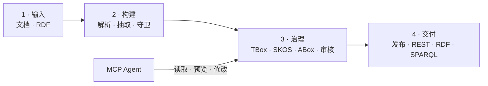
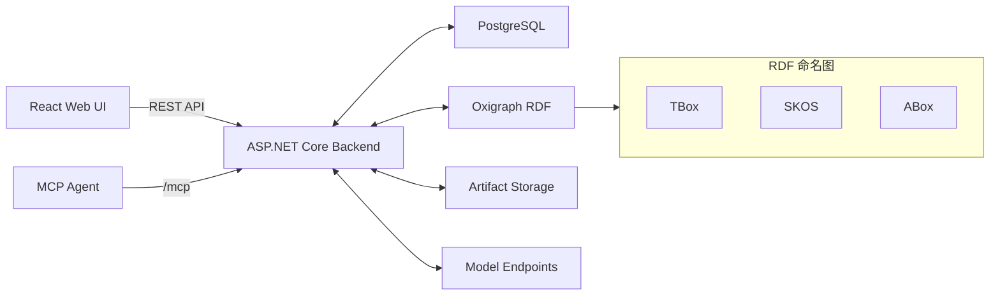

<div align="center">

# OntoPilot

**从源文档构建由人治理、可追溯、可发布的本体。**

`在每次审核中进化 · 从每个决策中学习`

在一个自托管工作台中完成 TBox、SKOS 术语、ABox 的构建、审阅、版本化、发布与服务。

[English](README.md) · [文档](#文档与接口) · [架构](docs/architecture.md) · [更新日志](CHANGELOG.md) · [路线图](ROADMAP.md) · [参与贡献](CONTRIBUTING.md) · [行为准则](CODE_OF_CONDUCT.md) · [安全策略](SECURITY.md)

[](LICENSE)
[](CHANGELOG.md)


</div>

<details>
<summary><strong>目录</strong></summary>

- [为什么选择 OntoPilot](#为什么选择-ontopilot)
- [Benchmark 亮点](#benchmark-亮点)
- [核心能力](#核心能力)
- [产品界面](#产品界面)
- [工作流程](#工作流程)
- [架构](#架构)
- [Docker 快速启动](#docker-快速启动)
- [MCP 与 Agent 集成](#mcp-与-agent-集成)
- [文档与接口](#文档与接口)
- [配置](#配置)
- [源码开发](#源码开发)
- [测试与 Benchmark](#测试与-benchmark)
- [运维](#运维)
- [安全与隐私](#安全与隐私)
- [路线图](#路线图)
- [开源协议](#开源协议)

</details>

## 为什么选择 OntoPilot

OntoPilot 是面向企业与业务团队的本体生产工作台：把散落在制度、手册、产品资料、研究成果和业务文档中的知识，快速沉淀为结构化、可计算的本体数据。

它不只是让大模型“生成一份本体”。OntoPilot 把领域专家、审核者与 Agent 放进同一条知识生产线：**AI 负责规模化阅读与起草，人负责消除歧义、校准和决策，平台负责证据、权限、版本与发布治理。** 最终交付的不是一次性的模型回答，而是一套能够被审核、被发布、被系统调用，并持续演进的企业知识资产。

- **从业务文档到可计算的领域知识。** 将分散的自然语言转化为相互关联的 TBox、SKOS 术语与 ABox，同时保留每条语句的原始依据。
- **让人机协作真正可治理。** 模型规模化提出候选，专家在聚焦的审核队列中修正与裁决，不必从头返工，也不必盲信生成结果。
- **每一次审核，都让智能体更懂你的业务。** 假设一份文档写“海洋探测器一号”，另一份写“海探1”。专家确认它们是同一设备并留下判断理由后，OntoPilot 会把这项决策沉淀为可复用的实体消歧记忆；下次再遇到“海探1”时，它会映射到正确实体，而不是重复创建。遇到新的叫法或冲突证据时，仍会回到人工审核。
- **从“看起来可用”走到生产可用。** 通过语义 Diff、不可变发布、回滚、REST API 与 MCP，把审核后的知识稳定交付给业务系统和 Agent。
- **可追溯不是补丁，而是底座。** 每项决策都能回到文档 chunk、模型、提示词快照、操作者与完整审核历史。

## Benchmark 亮点

### 在可直接对比项目上的提升

| 协议 F1 | Wine<br>食品与饮料 | GeoNames<br>地理 | OWL-Time<br>单位与度量 |
| --- | ---: | ---: | ---: |
| OntoLearner 参照 · Qwen3-8B | 18.60% | 19.70% | 14.08% |
| **OntoPilot 评测 · Qwen3-8B** | **28.95%** | **27.03%** | **16.67%** |
| **提升** | **+10.35 个百分点 / +55.6%** | **+7.33 个百分点 / +37.2%** | **+2.58 个百分点 / +18.3%** |
| 结论 | **新 SOTA** | 同模型领先 | 提示词提升 |

评测范围、基线口径、提示词配置与复现细节见
[Benchmark 方法与完整报告](docs/benchmarks/ontolearner-multidomain.md)。

## 核心能力

| 领域 | 能力 |
| --- | --- |
| 文档接入 | PDF、Word、Excel、Markdown、CSV、文本；结构化切分；目录；批量解析 |
| 本体抽取 | 类、属性、上下位、互斥、等价、定义域、值域和注释 |
| 实例抽取 | 实例、类型、对象断言、数据断言和实体消歧 |
| 受控术语 | SKOS 词表与概念、多语言标签、别名、层级、映射和提案 |
| 人工审核 | 冲突、实体消歧、术语、ABox 验证四个队列，支持搜索和组合筛选 |
| 治理 | 知识体系角色、可编辑提示词、提示词历史、溯源、审计和回滚 |
| 发布工程 | 草稿 → 已审核 → 已发布、不可变快照、语义 Diff、恢复与部署 |
| 导出 | TBox、术语、ABox 分层导出；完整包；异步 N-Quads 分片 |
| 对外服务 | 知识体系 API Token、固定版本 REST、RDF 导出、受限只读 SPARQL |
| Agent 集成 | 随后端自动启动的 Streamable HTTP MCP，覆盖读取、建议、修改、审核和生命周期 |
| 互操作 | RDF 直接导入，支持自动 TBox/ABox 分类或显式选择目标层 |
| 国际化 | 中英文界面和文档；后端提示词系统语言独立配置 |

## 产品界面


本体工作台在同一视图中整合类导航、关系图谱和实体详情；项目侧边栏则将审核队列、发布、文档、历史、成员和 API 访问串联在统一的治理流程中。

## 工作流程



只要仍有阻断性冲突、待消歧实体、待审术语或 ABox 验证错误，发布质量门禁就不会允许审核通过。

## 架构



| 组件 | 职责 |
| --- | --- |
| React + TypeScript | 治理工作台、图谱浏览、审核、发布、设置和文档 |
| ASP.NET Core 10 | 认证、权限、接入、抽取编排、审核、发布、REST 与 MCP |
| PostgreSQL | 用户、角色、文档/任务元数据、提示词快照、溯源、审核状态、审计和发布记录 |
| Oxigraph | 可变 TBox/SKOS/ABox 图，以及独立的已发布版本服务投影 |
| 制品存储 | 源文件、不可变快照、清单、溯源 JSONL 和导出分片 |
| 模型端点 | 管理员配置的 OpenAI 兼容对话/向量服务，支持每端点独立限流 |

SQLite 适用于单进程本地开发；共享环境和 Docker 部署使用 PostgreSQL。信任边界、图层隔离、溯源和导出设计详见[架构文档](docs/architecture.md)。

## Docker 快速启动

### 环境要求

- Docker Engine 27+ 和 Docker Compose v2
- 至少 2 GB 可用内存；建议使用 4 GB，以便更顺畅地完成 Docker 构建和启动
- 抽取时需要 OpenAI 兼容 API 凭据；没有凭据时应用仍可启动

### 1. 配置

```bash
git clone https://github.com/deeplethe/ontopilot.git
cd ontopilot
cp .env.example .env
cp src/.env.example src/.env
```

至少修改以下顶层 `.env`：

```dotenv
# .env
POSTGRES_PASSWORD=替换为强随机密码
SYSTEM_LANGUAGE=zh-CN
MCP_PUBLIC_URL=http://localhost:8080/mcp
ONTOPILOT_BIND_ADDRESS=0.0.0.0
ONTOPILOT_PORT=8080
```

以及 `src/.env`：

```dotenv
# src/.env
OnToPilot__LlmApiKey=sk-or-v1-your-key
OnToPilot__CookieSecure=false
```

全新安装必须设置管理员密码。若管理员密码为空、过短或仍是公开示例值，OntoPilot 会拒绝创建首个管理员；
请通过 `docker compose --profile bootstrap run --rm seed-admin` 完成首次引导，并使用至少 12 个字符的密码。

`SYSTEM_LANGUAGE` 控制内置模型提示词（`en` 或 `zh-CN`），与每个用户选择的前端语言无关；知识体系级提示词覆盖始终优先。

### 2. 启动并检查

```bash
docker compose up -d --build
docker compose ps
curl --fail http://localhost:8080/api/health
```

打开 <http://localhost:8080>，使用配置的管理员账号登录。首次构建后容器可能需要短暂时间进入健康状态。

如需仅本机可访问的隔离部署：

```dotenv
ONTOPILOT_BIND_ADDRESS=127.0.0.1
ONTOPILOT_PORT=18080
MCP_PUBLIC_URL=http://127.0.0.1:18080/mcp
```

### 3. 停止

```bash
docker compose down
```

该命令保留命名卷。`docker compose down -v` 会永久删除当前部署的 PostgreSQL 和 OntoPilot 数据卷，只有明确需要全新环境时才可使用。

## 第一次完整治理流程

1. 打开 **设置 → 模型端点**，配置对话/向量服务，为每个端点设置独立并发限制并测试连接。
2. 创建知识体系，以 owner、editor 或 viewer 身份邀请成员。
3. 在 **文档** 中上传 `examples/pump-operations.txt` 并解析。
4. 选择已解析 chunk，运行 **TBox**、**ABox** 或组合抽取。
5. 检查本体、受控术语、实例、来源证据和抽取任务。
6. 清空冲突、实体消歧、术语和验证四个审核队列。
7. 创建发布草稿，通过质量门禁，审核并正式发布。
8. 部署发布投影，或导出完整制品供下游系统使用。

首次启动后端前设置 `OnToPilot__SeedDemoData=true`，可以在不调用模型的情况下创建确定性的 Pump Operations 演示库。

## MCP 与 Agent 集成

MCP 默认在 `/mcp` 提供服务，并与后端使用同一个生命周期自动启动，不需要额外安装或守护 MCP 进程。每个 MCP Token 绑定一个用户和一个知识体系；每次调用都取 Token Scope 与用户实时角色的交集。

```json
{
  "mcpServers": {
    "ontopilot": {
      "type": "streamable-http",
      "url": "http://localhost:8080/mcp",
      "headers": {
        "Authorization": "Bearer ${ONTOPILOT_MCP_TOKEN}"
      }
    }
  }
}
```

| Scope | 最低知识体系角色 | 能力示例 |
| --- | --- | --- |
| `mcp:read` | Viewer | 本体、文档、词表、实例、证据、审核队列、历史、发布、SPARQL |
| `mcp:write` | Editor | 预览/应用 TBox、ABox、SKOS 修改，处理审核项，启动抽取 |
| `mcp:manage` | Owner | 发布、部署、停止/删除发布版本、回滚审计变更 |

修改 Tool 必须携带审计原因；破坏性操作必须显式确认；本体修改可以先返回精确 RDF Diff，再由用户决定是否执行。请在知识体系的 API 访问区域创建短期 MCP Token，不要把浏览器 Cookie 或 Token 写入提示词、日志或源码。

[MCP 中文指南](frontend/src/content/docs/zh-CN/mcp.md)列出了全部已注册 Tool，以及推荐的“读取证据 → 预览 → 用户确认 → 执行”流程。

## 文档与接口

登录后通过 `/docs` 打开文档中心。左侧目录树中的每一项对应独立的中/英文 Markdown，右侧渲染 Markdown 和项目主题色 Mermaid 图。

| 资源 | 默认地址 / 文件 |
| --- | --- |
| 产品与设计文档 | <http://localhost:8080/docs> |
| MCP 指南 | <http://localhost:8080/docs/mcp> |
| OpenAPI UI | <http://localhost:8080/api/docs> |
| ReDoc | <http://localhost:8080/api/redoc> |
| OpenAPI JSON | <http://localhost:8080/api/openapi.json> |
| 健康检查 | <http://localhost:8080/api/health> |
| 外部 API 指南 | [docs/external-api.zh-CN.md](docs/external-api.zh-CN.md) |
| RDF 导入指南 | [docs/rdf-import.zh-CN.md](docs/rdf-import.zh-CN.md) |
| 发布和导出指南 | [docs/release-and-export.md](docs/release-and-export.md) |

浏览器治理 API 使用 HttpOnly Session Cookie。下游应用使用可吊销的知识体系 API Token，并访问 `/api/v1/knowledge-systems/{public_id}` 下的版本化接口。生产消费者应固定发布版本；`/published` 会有意跟随最新发布版本。

## 发布、服务与导出

草稿使用内部标识，只有发布成功才分配公开 `vN` 版本。因此删除未发布草稿不会消耗下一个公开版本号。

每次发布固化三层 RDF 和溯源文件：

```text
release/
├── manifest.json
├── tbox-00001.nq
├── vocabulary-00001.nq
├── abox-00001.nq
├── abox-00002.nq
├── tbox-provenance.jsonl
└── abox-provenance.jsonl
```

制品有意保持未压缩，以支持 HTTP Range、逐行处理、分片独立校验和对象存储/CDN 复制；清单记录 SHA-256。反向代理仍可启用传输压缩。

## 配置

仓库中的 [.env.example](.env.example) 和 [src/.env.example](src/.env.example) 是配置参考。

| 变量 | 默认值 | 用途 |
| --- | --- | --- |
| `POSTGRES_PASSWORD` | 必填 | PostgreSQL 密码；为空时 Compose 会拒绝启动 |
| `SYSTEM_LANGUAGE` | `en` | 内置后端提示词语言（`en` / `zh-CN`），独立于前端语言 |
| `ONTOPILOT_BIND_ADDRESS` | `0.0.0.0` | 前端容器映射到宿主机的监听地址 |
| `ONTOPILOT_PORT` | `8080` | 前端容器映射到宿主机的端口 |
| `OnToPilot__Persistence__ConnectionString` | Compose 管理 PostgreSQL | EF Core 连接串；Compose 会自动注入 PostgreSQL |
| `OnToPilot__LlmApiKey` | 空 | 初始兼容模型凭据；也可在设置页管理端点 |
| `OnToPilot__ExtractModel` | `deepseek/deepseek-chat` | 初始抽取/Agent 模型 |
| `OnToPilot__EmbeddingModel` | `baai/bge-m3` | 初始向量模型 |
| `MCP_PUBLIC_URL` | `http://localhost:8080/mcp` | 后端向客户端声明的 Streamable HTTP 地址 |
| `OnToPilot__McpTokenTtlMinutes` | `60` | 委派 MCP Token 默认有效期 |
| `TOKEN_ENCRYPTION_KEY` | 在数据卷中生成 | 可再次显示的 API Token 密钥加密材料，必须备份 |
| `OnToPilot__CookieSecure` | `false` | 是否要求浏览器 Session Cookie 只能通过 HTTPS 传输 |
| `OnToPilot__SeedDemoData` | `false` | 是否向空数据库写入无模型调用的演示数据 |
| `OnToPilot__RdfImportMaxBytes` | `26214400` | RDF 直接上传大小上限 |
| `OnToPilot__RdfImportMaxTriples` | `250000` | RDF 解析语句数上限 |

## 源码开发

### 环境要求

- .NET SDK 10
- Node.js 22+
- Corepack 与 pnpm 10.2.1（已在 `frontend/package.json` 固定）

### 后端

```bash
cp src/.env.example src/.env
dotnet run --project src/OnToPilot
```

.NET 后端默认监听 `http://localhost:5072`（见 `src/OnToPilot/Properties/launchSettings.json`）。
未设置 `OnToPilot__Persistence__Provider` / `OnToPilot__Persistence__SqliteConnection` 覆盖时，
后端把本地开发数据写入 `./src/OnToPilot/data/`（SQLite + Oxigraph）。

### 前端

```bash
cd frontend
corepack enable
pnpm install --frozen-lockfile
pnpm dev
```

Vite 默认运行在 <http://localhost:5173>，并把 `/api` 和 `/mcp` 代理到 `http://localhost:5072`。隔离源码部署可以覆盖目标：

```bash
VITE_BACKEND_PROXY_TARGET=http://127.0.0.1:18080 pnpm dev --host 127.0.0.1 --port 15173
```

PowerShell 请先设置 `$env:VITE_BACKEND_PROXY_TARGET`，再执行 `pnpm dev`。

## 测试与 Benchmark

运行核心测试、Lint、构建和契约检查：

```bash
dotnet test src/OnToPilot.Tests
dotnet test src/OnToPilot.ApiContract.Tests

cd frontend
pnpm lint
pnpm build

cd ..
docker compose config --quiet
```

集成测试位于 `tests/OnToPilot.Integration.Tests`，依赖运行中的 PostgreSQL 与 MinIO，在多数环境中被软跳过。
本机可在 `docker compose up -d postgres minio` 之后执行 `dotnet test tests/OnToPilot.Integration.Tests`。

Taxonomy 评测方法和复现说明统一维护在 [Benchmark 报告](docs/benchmarks/ontolearner-multidomain.md) 中。

完整人工端到端路径见 [docs/acceptance.md](docs/acceptance.md)。

## 运维

### 备份

以下内容必须组成一套一致的恢复数据：

- `ontopilot-postgres` 卷，或由 `pg_dump` 生成的备份；
- `ontopilot-data` 卷，其中包含文档、Oxigraph、发布版本、导出和自动生成的 Token 密钥；
- 通过密钥管理系统保存的部署 `.env`，不得提交到 Git。

请定期进行恢复演练。仅恢复数据库是不完整的，因为 RDF 图和制品位于 PostgreSQL 之外。

### 升级

```bash
git pull --ff-only
docker compose build --pull
docker compose up -d
docker compose ps
curl --fail http://localhost:8080/api/health
```

升级前先备份，检查示例配置变量变化；1.0 之前应先在生产数据副本上验证。

### 反向代理检查项

- 终止 TLS，并设置 `OnToPilot__CookieSecure=true`；
- 把 `MCP_PUBLIC_URL` 设置为外部可访问的 HTTPS `/mcp` 地址；
- `/mcp` 需要保持流式传输并关闭响应缓冲；
- 按文档接入需要设置上传大小、限流和超时；
- PostgreSQL 和后端内部端口不得直接暴露公网。

### 常见问题

| 现象 | 检查项 |
| --- | --- |
| 前端启动但 API 请求失败 | `docker compose ps`、后端健康状态、Nginx 日志 |
| 源码前端意外请求 5072 | 启动 Vite 前设置 `VITE_BACKEND_PROXY_TARGET` |
| 无法抽取 | 测试当前模型端点，检查凭据、模型名和端点并发限制 |
| MCP 返回 `401` | 在 `Authorization: Bearer` Header 中使用未过期的 `opm_...` Token |
| HTTPS 后重复登录 | 设置 `OnToPilot__CookieSecure=true`，检查代理的协议和 Host 转发 |
| 后端无法打开 Oxigraph | 确保同一数据目录只有一个后端进程，并检查数据卷权限 |

## 安全与隐私

被选择的源 chunk 和有限的本体上下文会发送给管理员配置的模型供应商。除非运维人员配置外部存储或服务，文档、RDF 图、关系元数据、凭据和发布制品都保留在部署环境内。

公开部署前：

- 配置强管理员密码和 PostgreSQL 密码；
- 启用 HTTPS 和安全 Cookie；
- 保护并备份 Token 加密材料；
- 缩小 API/MCP Token Scope、设置有效期并及时吊销；
- 限制模型端点、反向代理请求大小和频率；
- 阅读 [SECURITY.md](SECURITY.md)，并通过私密渠道报告漏洞。

## 路线图

路线图表达方向，不构成发布日期承诺。目标、验收标准与非目标见 [ROADMAP.md](ROADMAP.md)。

- **稳定性：** 正式迁移与升级测试、备份恢复工具、生产可观测性、无障碍和浏览器覆盖。
- **协作：** 更完善的审核分配、评论/提及、通知、保存筛选条件和大团队审计流程。
- **Agent 辅助治理：** 第一方对话页面，使用短期用户 MCP Token，并在执行前展示可审核变更预览。
- **集成：** 对象存储适配、Webhook/事件、身份提供商集成和常用平台部署模板。
- **规模与质量：** 增加 MinerU 等可插拔解析框架、更大语料接入、增量抽取、Benchmark 扩展、发布可复现和性能预算。
- **建模与推演：** 时空建模，以及受治理、可版本化、可复现的沙盘推演和假设分析。
- **达到 1.0：** 稳定 REST/MCP/发布契约、兼容性策略、迁移、灾难恢复验证和安全审查。

## 项目规范

- 欢迎贡献，流程见 [CONTRIBUTING.md](CONTRIBUTING.md)。
- 社区参与遵守 [CODE_OF_CONDUCT.md](CODE_OF_CONDUCT.md)。
- 安全问题必须使用 [SECURITY.md](SECURITY.md) 中的私密渠道，不要创建公开 Issue。
- 公共交换格式变化必须提供兼容性说明、必要迁移和回归测试。
- AI 生成的本体修改与人工修改遵守相同的证据、审核、权限和审计规则。

## 开源协议

Copyright 2026 DeepLethe and OntoPilot contributors.

本项目使用 [Apache License 2.0](LICENSE) 开源，并包含 [NOTICE](NOTICE)。除法律要求或书面约定外，本软件按**现状**提供，不附带任何明示或默示担保。
