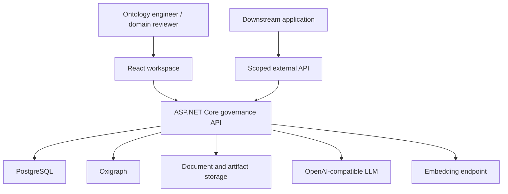
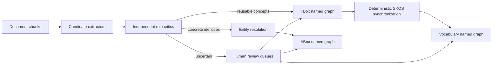
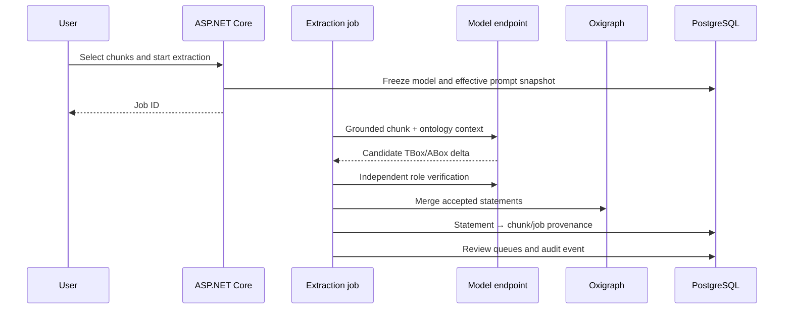
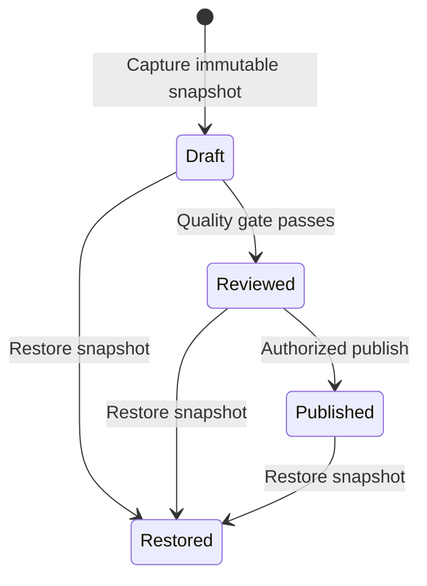
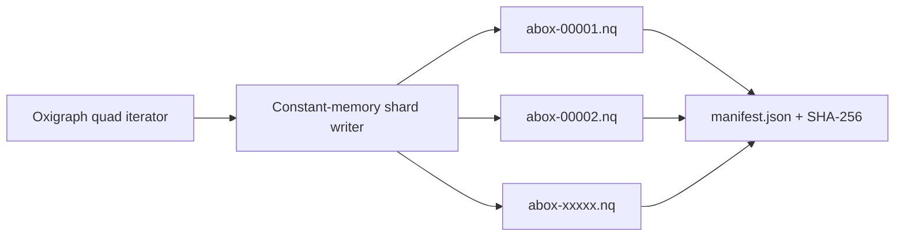

# OntoPilot Architecture

## System Context

## Storage Boundaries

| Store | Responsibility |
| --- | --- |
| PostgreSQL | Users, roles, documents, chunks, jobs, prompt snapshots, review queues, provenance, audit events, releases, and export jobs |
| Oxigraph | Mutable RDF named graphs for TBox, SKOS terminology, and ABox |
| Serving Oxigraph | Read-only release projections in dedicated version-scoped named graphs |
| Artifact storage | Source blobs, immutable release snapshots, manifests, provenance JSONL, and export shards |

SQLite remains a local-development fallback. It is not the recommended shared-deployment database.

## Knowledge-System Graphs

The layers are intentionally separate:

- TBox is a reusable conceptual schema.
- SKOS terminology governs lexical forms and mappings.
- ABox contains identities and assertions.

## Extraction and Provenance

The prompt snapshot stores exact contents and SHA-256 hashes. Editing a project prompt affects future jobs only.

## Release State Machine

The quality gate blocks review while unresolved error conflicts, entity-resolution items, terminology proposals, or ABox validation errors remain.

## Export Design

ABox export never materializes the complete graph in memory. Oxigraph quads are streamed into fixed-statement-count `.nq` shards. Each shard is uncompressed and independently checksummed.

Uncompressed shards support line-oriented processing, HTTP range requests, CDN/object-storage replication, and independent retry. A reverse proxy may apply transport compression without changing the artifact format.

## Published Service Boundary

Publishing verifies the immutable artifacts, streams them into a separate serving Oxigraph database, and indexes the captured provenance by release and statement key in PostgreSQL. Public fixed-version REST and SPARQL routes only use those projections. Deployment state is independent from release state, so a service may be stopped and rebuilt without changing the release. Terminal release deletion clears the projection and artifacts but retains a tombstone and audit evidence.

## Trust Boundaries

- Browser sessions and machine API tokens are separate credentials.
- External SPARQL is read-only and bounded.
- Per-knowledge-system roles gate governance operations.
- Model endpoints receive selected chunks and bounded ontology context, not unrestricted filesystem or database access.
- Graph mutations produce audit events; release artifacts are immutable after capture.
