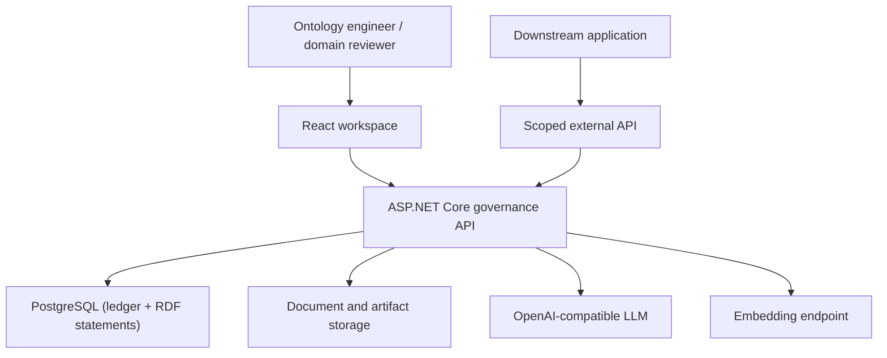
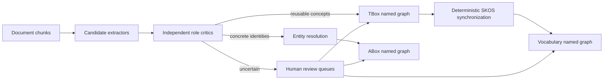
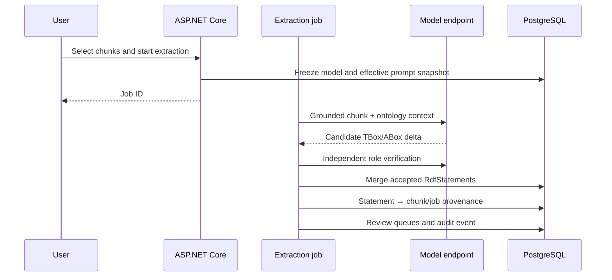
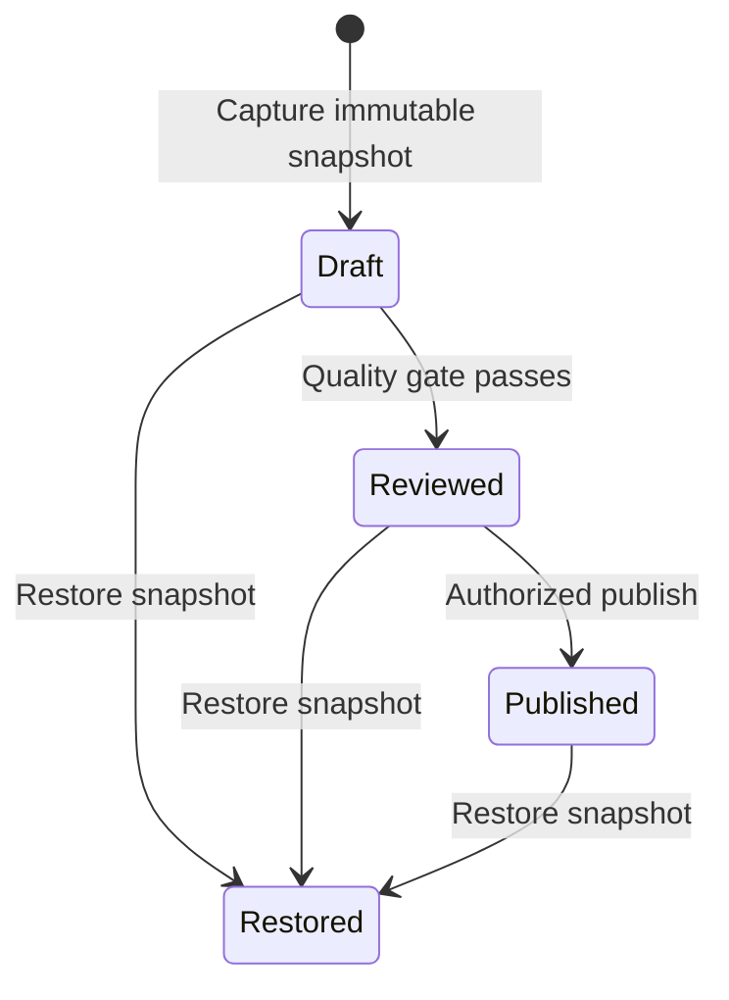
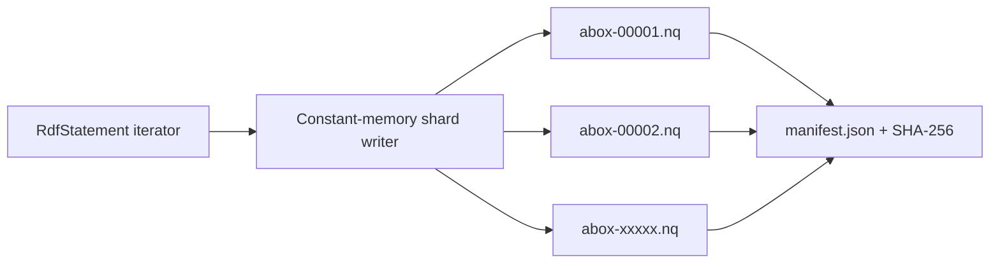

# ISEStudio Architecture

## System Context

```mermaid
flowchart TB
    HUMAN["Ontology engineer / domain reviewer"] --> UI["React workspace"]
    CLIENT["Downstream application"] --> EXT["Scoped external API"]
    UI --> API["ASP.NET Core governance API"]
    EXT --> API
    API --> PG["PostgreSQL (ledger + RDF statements)"]
    API --> ART["Document and artifact storage"]
    API --> LLM["OpenAI-compatible LLM"]
    API --> EMB["Embedding endpoint"]
```

## Storage Boundaries

| Store | Responsibility |
| --- | --- |
| PostgreSQL | Users, roles, documents, chunks, jobs, prompt snapshots, review queues, provenance, audit events, releases, export jobs, and the RDF statement workspace (`WorkspaceStatementEntity`) |
| PostgreSQL (release) | Read-only release projections in `ReleaseStatementEntity`, version-scoped per release |
| Artifact storage | Source blobs, immutable release snapshots, manifests, provenance JSONL, and export shards |
| Legacy graph reader (offline) | `ISEStudio.Migration` and `ISEStudio.OxigraphProbe` — the only projects that may reference Oxigraph; see *Runtime RDF dependency boundary* below |

SQLite remains a local-development fallback. It is not the recommended shared-deployment database.

## Runtime RDF Dependency Boundary

The runtime is PostgreSQL-authoritative for all RDF state: workspace layers
(TBox / ABox / vocabulary) live in `WorkspaceStatementEntity` rows accessed
through `IRdfStatementRepository`, and releases serve from
`ReleaseStatementEntity`. The runtime opens no on-disk embedded graph store —
startup under any database provider does not create `data/rdf` (enforced by
the host smoke test and by `scripts/verify-postgresql-authoritative-storage.ps1`).

The explicit migration exception: `ISEStudio.Migration` and
`ISEStudio.OxigraphProbe` may reference Oxigraph because neither is hosted by
the runtime. Migration retains direct RocksDB validation of legacy data and an
N-Quads fallback path; it is a one-time reader, never part of the serving
pipeline.

## Graph Ledger

PostgreSQL is the sole runtime authority for the knowledge graph ledger. Entity types,
relation types, entities, facts, evidence, conflicts, validity windows, and audit records
are stored in the ISEStudio schema and scoped by `KnowledgeSystemId`.

Facts are append-only SPO assertions. Invalidation and supersession preserve the original
row and its provenance instead of deleting historical facts. Neighborhood reads use a
parameterized recursive CTE with a maximum depth of five, effective-time filtering, cycle
guards, and knowledge-system isolation. The active subject/object indexes support these
bounded traversals.

RDF statement storage shares the same PostgreSQL authority: `RdfStatement` rows are the
TBox / ABox / vocabulary layers, written through the statement repository with
revert-on-error layer replacement. PostgreSQL remains authoritative for the operational
graph and its governance history; the legacy embedded graph reader exists only in the
offline migration tooling.

## Knowledge-System Graphs

```mermaid
flowchart LR
    DOC["Document chunks"] --> PROPOSE["Candidate extractors"]
    PROPOSE --> CRITIC["Independent role critics"]
    CRITIC -->|"reusable concepts"| TBOX["TBox named graph"]
    CRITIC -->|"concrete identities"| RESOLVE["Entity resolution"]
    RESOLVE --> ABOX["ABox named graph"]
    TBOX --> SYNC["Deterministic SKOS synchronization"]
    SYNC --> TERMS["Vocabulary named graph"]
    CRITIC -->|"uncertain"| REVIEW["Human review queues"]
    REVIEW --> TBOX
    REVIEW --> TERMS
    REVIEW --> ABOX
```

The layers are intentionally separate:

- TBox is a reusable conceptual schema.
- SKOS terminology governs lexical forms and mappings.
- ABox contains identities and assertions.

## Extraction and Provenance

```mermaid
sequenceDiagram
    participant U as User
    participant API as ASP.NET Core
    participant J as Extraction job
    participant M as Model endpoint
    participant P as PostgreSQL

    U->>API: Select chunks and start extraction
    API->>P: Freeze model and effective prompt snapshot
    API-->>U: Job ID
    J->>M: Grounded chunk + ontology context
    M-->>J: Candidate TBox/ABox delta
    J->>M: Independent role verification
    J->>P: Merge accepted RdfStatements
    J->>P: Statement → chunk/job provenance
    J->>P: Review queues and audit event
```

The prompt snapshot stores exact contents and SHA-256 hashes. Editing a project prompt affects future jobs only.

## Release State Machine

```mermaid
stateDiagram-v2
    [*] --> Draft: Capture immutable snapshot
    Draft --> Reviewed: Quality gate passes
    Reviewed --> Published: Authorized publish
    Draft --> Restored: Restore snapshot
    Reviewed --> Restored: Restore snapshot
    Published --> Restored: Restore snapshot
```

The quality gate blocks review while unresolved error conflicts, entity-resolution items, terminology proposals, or ABox validation errors remain.

## Export Design

ABox export never materializes the complete graph in memory. `RdfStatement` rows from the statement repository are streamed into fixed-statement-count `.nq` shards. Each shard is uncompressed and independently checksummed.

```mermaid
flowchart LR
    OXI["RdfStatement iterator"] --> WRITER["Constant-memory shard writer"]
    WRITER --> NQ1["abox-00001.nq"]
    WRITER --> NQ2["abox-00002.nq"]
    WRITER --> NQN["abox-xxxxx.nq"]
    NQ1 --> MANIFEST["manifest.json + SHA-256"]
    NQ2 --> MANIFEST
    NQN --> MANIFEST
```

Uncompressed shards support line-oriented processing, HTTP range requests, CDN/object-storage replication, and independent retry. A reverse proxy may apply transport compression without changing the artifact format.

## Published Service Boundary

Publishing verifies the immutable artifacts, loads them into the PostgreSQL `ReleaseStatementEntity` table, and indexes the captured provenance by release and statement key. Public fixed-version REST and SPARQL routes only use those projections. Deployment state is independent from release state, so a service may be stopped and rebuilt without changing the release. Terminal release deletion clears the projection and artifacts but retains a tombstone and audit evidence.

## Trust Boundaries

- Browser sessions and machine API tokens are separate credentials.
- External SPARQL is read-only and bounded.
- Per-knowledge-system roles gate governance operations.
- Model endpoints receive selected chunks and bounded ontology context, not unrestricted filesystem or database access.
- Graph mutations produce audit events; release artifacts are immutable after capture.
