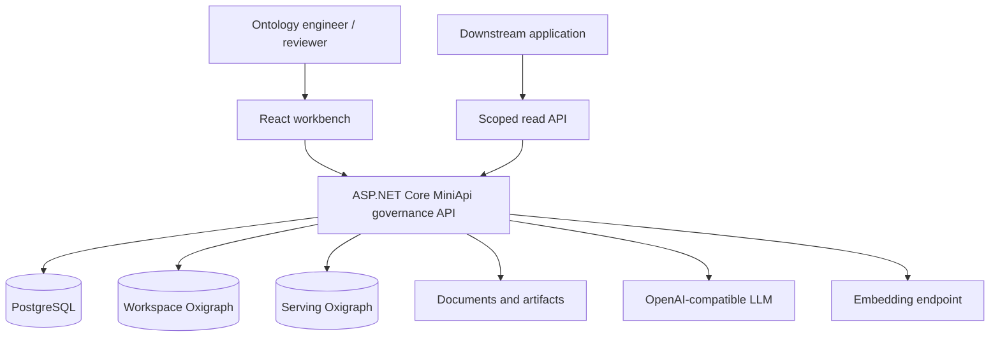

# System architecture

The React workbench owns interaction and ASP.NET Core MiniApi owns governance and service boundaries. Relational metadata, RDF graphs, and immutable artifacts use purpose-built storage.

## Write path

Browser sessions call governance routes. Background jobs call model endpoints. Accepted statements enter workspace Oxigraph while jobs, evidence, review items, and audit events enter PostgreSQL.

## Read path

The internal UI reads the workspace according to Owner, Editor, or Viewer role. Machine tokens use separate read-only routes. Pinned routes access serving projections only and never fall through to mutable workspace graphs.

## Trust boundaries

- Browser sessions and machine tokens are separate credentials.
- Workspace graphs and release-serving graphs are separate stores.
- TBox, SKOS, and ABox use independent named graphs.
- Model endpoints receive selected chunks and bounded context only.
- Graph mutation and publishing produce audit events.
