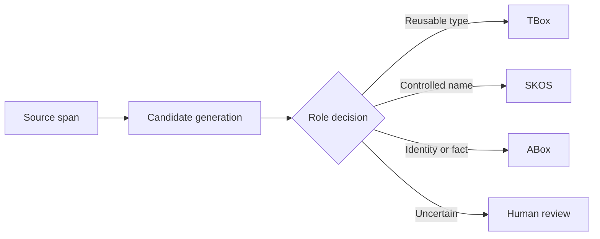

# Core concepts

The three-layer knowledge model is ISEStudio's most important design boundary. Correct placement determines whether review, query, and release behavior remains reliable.

## TBox

TBox stores reusable classes, object properties, data properties, and schema axioms. `Pump` is a class, `installedAt` is an object property, and “CentrifugalPump is a subclass of Pump” is an axiom. Device IDs, specific places, one-off events, and literal values do not belong here.

## SKOS vocabulary

The vocabulary layer governs preferred labels, aliases, hidden search labels, languages, and lexical hierarchy. A concept can map to a TBox entity or remain a standalone domain term.

## ABox

ABox stores concrete identities and facts. `Orion-7` is a pump instance, while `Orion-7 installedAt Site-A` is an assertion. ABox uses a separate named graph but connects to TBox through type and property IRIs.

Independent critics and deterministic guards stop capitalized names, identifiers, scalar fields, and XML Schema datatypes from being promoted into domain classes.
