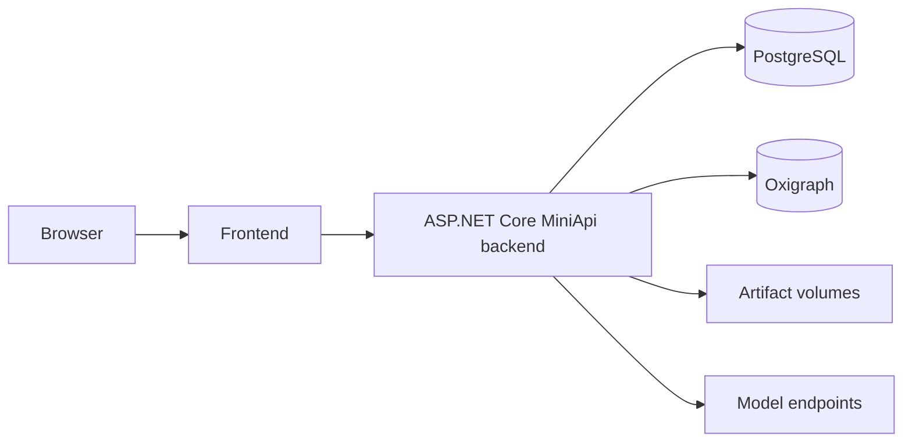

# Docker and configuration

Docker Compose provides PostgreSQL, ASP.NET Core MiniApi, and React services. Model endpoints, prompts, and system language are configured independently.

```bash
cp src/.env.example src/.env
cp .env.example .env
docker compose up -d --build
```

Before the first start, set a strong `POSTGRES_PASSWORD` in `.env` and seed the first
admin via `docker compose --profile bootstrap run --rm seed-admin` (use at least 12 characters).
Empty or published example credentials intentionally stop initialization instead of creating a
weak administrator.



## System language

```dotenv
SYSTEM_LANGUAGE=en
```

Allowed values are `en` and `zh-CN`. This controls built-in model prompts and is independent from the user's UI locale. Knowledge-system overrides take precedence and are never overwritten by a language change.

## Model endpoints and prompts

Each connected service has its own URL, model, credential, and concurrency limit. LLM, embedding, and provider capacity are isolated by endpoint. Extraction jobs record the effective prompt contents and SHA-256 for audit and reproduction.

## Production checklist

- Enable HTTPS and `ISEStudio__CookieSecure=true`.
- Replace default administrator and database credentials.
- Back up PostgreSQL, both Oxigraph stores, artifacts, and encryption keys.
- Configure reverse-proxy body limits, timeouts, rate limits, and access logs.
- Monitor `/api/health` and background jobs.
- Run backend tests and the frontend build before upgrades.
