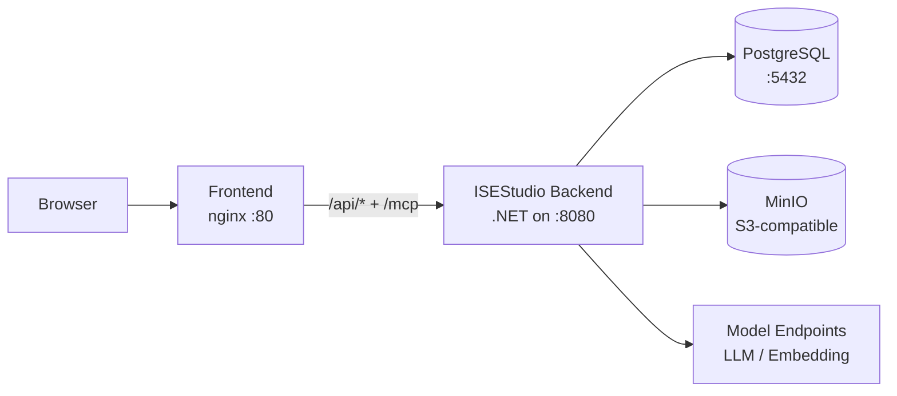

# Docker and configuration

Docker Compose provides PostgreSQL, the ISEStudio .NET backend, MinIO (S3-compatible artifact storage), and the React frontend. Model endpoints, prompts, and system language are configured independently.

## Startup sequence

```bash
# 1. Copy both .env templates
cp src/.env.example src/.env
cp .env.example .env

# 2. Set a strong POSTGRES_PASSWORD + MINIO_ACCESS_KEY + MINIO_SECRET_KEY in the root .env
$EDITOR .env

# 3. Set SEED_ADMIN_USERNAME + SEED_ADMIN_PASSWORD in src/.env (password >= 12 chars)
$EDITOR src/.env

# 4. Bootstrap the first admin (equivalent to a migration; the bootstrap profile is opt-in)
docker compose --profile bootstrap run --rm seed-admin

# 5. Bring up the full stack (the migrate container applies EF Core schema, then the backend starts)
docker compose up -d --build
```

The first-boot flow has four phases that MUST happen in order:

| Phase | Who runs it | Purpose |
| --- | --- | --- |
| migrate | `isestudio-migrate` container (runs automatically with `up -d`) | Applies EF Core schema migrations and creates all tables |
| seed-admin | `--profile bootstrap run --rm seed-admin` | Inserts the first admin into `users`; credentials come from `SEED_ADMIN_USERNAME` / `SEED_ADMIN_PASSWORD` env vars |
| backend | `isestudio` container | `BootstrapAdminService` checks `users` is non-empty at boot -> passes -> listens on :8080 |
| frontend | `frontend` container | nginx reverse-proxies `:80` -> backend `isestudio:8080` |

> `seed-admin` reads credentials from `src/.env` instead of CLI args, so the password never appears in `docker compose ps` output or shell history. The command is **idempotent** — re-running after a successful seed exits 0 without writing again.
>
> If you can only reach the postgres container and the backend image is unavailable, fall back to manual SQL INSERT following [`docs/superpowers/runbooks/2026-08-25-fresh-deployment-bootstrap.md`](../../../../../docs/superpowers/runbooks/2026-08-25-fresh-deployment-bootstrap.md) (283 lines, covers mixed-case EF column quoting + cross-language BCrypt hash generation). This is a **fallback path** — the default is `seed-admin`.



To pick up backend config changes, rebuild only the `isestudio` container:

```bash
docker compose up -d isestudio
```

## System language

```dotenv
SYSTEM_LANGUAGE=en
```

Allowed values are `en` and `zh-CN`. This controls **built-in model prompts** and is independent from each user's UI locale. Knowledge-system overrides take precedence and are never overwritten by a language change.

After editing `SYSTEM_LANGUAGE` in the root `.env`, rebuild the backend:

```bash
docker compose up -d isestudio
```

(`SYSTEM_LANGUAGE` is interpolated by docker-compose.yml into `ISEStudio__SystemLanguage` and injected into the `isestudio` container; you don't need to set it again in `src/.env`.)

## Model endpoints

Each connected service has its own URL, model, credential, and concurrency limit. LLM, embedding, and provider capacity are isolated by endpoint. Without any model credentials configured, the UI and non-LLM features still start; LLM-dependent pipelines (extraction, embedding, terminology suggestions) fail closed by design with a clear missing-credential error.

## Prompts

Administrators can inspect the built-in definitions; knowledge systems can override individual prompts. Each extraction task records the effective prompt text and SHA-256 for audit and reproduction. Built-in prompt text changes with `SYSTEM_LANGUAGE`, but user overrides are sticky and never overwritten by a language flip.

## Service inventory

| Compose service | Image / source | Exposed | Role |
| --- | --- | --- | --- |
| `postgres` | `postgres:16-alpine` | `:5432` (host optional) | Main store (users / KS / chunks / audit) |
| `minio` | `minio/minio:latest` | `:9000-9001` (host optional) | S3-compatible object store (RDF imports / export artifacts) |
| `isestudio-migrate` | `isestudio-backend` (same image, different entrypoint) | none | One-shot EF Core schema migration (Exited 0) |
| `isestudio-seed-admin` | `isestudio-backend` (`--profile bootstrap`) | none | One-shot admin insert; only run in §1 step 4 |
| `isestudio` | `isestudio-backend` | intra-net `:8080` (fronted by frontend nginx) | Main backend process |
| `frontend` | `ontopilot-frontend` (local build) | `:8080->:80` (controlled by `ISESTUDIO_PORT`) | nginx SPA + reverse-proxy for `/api/*` `/mcp` |

Container names follow `<project-prefix>_<service>-<index>`. The default project prefix is the directory containing `docker-compose.yml`, i.e. `ontopilot_*` (`ontopilot-postgres-1`, `ontopilot-isestudio-1`, `ontopilot-frontend-1`, ...). Override with `COMPOSE_PROJECT_NAME` to change the prefix globally.

## Production checklist

- Enable HTTPS and `ISEStudio__CookieSecure=true` (cookie name is `isestudio_session`, default `secure=false` for dev).
- Replace the default admin password and create a second admin for redundancy.
- Replace `POSTGRES_PASSWORD` / `MINIO_ACCESS_KEY` / `MINIO_SECRET_KEY` with strong random values.
- Back up PostgreSQL + MinIO buckets (`isestudio-data` / `isestudio-minio` docker volumes).
- Store the token encryption key and document the recovery procedure.
- Configure reverse-proxy body limits, timeouts, rate limits, and access logs (frontend nginx defaults `proxy_read_timeout 300s` for long-running extraction polling).
- Monitor `/api/health` and background jobs.
- Before upgrades, run the backend test suite + frontend build + `docker compose config --quiet` (must exit 0).
- First-time deploys MUST follow §1's 5-step sequence rather than a bare `up -d` — otherwise the backend exits 17 on an empty `users` table and falls into the runbook's manual-SQL path.
