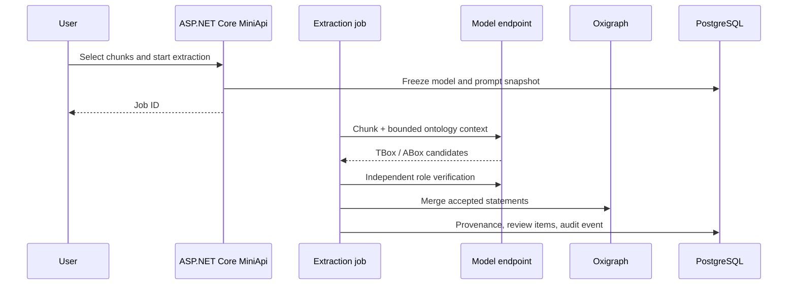

# Documents and extraction

The document workspace manages source material, parse results, chunk previews, and extraction jobs. Model services receive selected chunks and bounded ontology context only.

## Sources and storage

PDF, Word, Excel, Markdown, CSV, text, and RDF sources are supported. Raw bytes enter content-addressed storage; identical blobs may be reused while each knowledge system retains its own document record, folder, and processing state.

## Extraction pipeline

Candidate generators propose structure; independent critics classify reusable concepts versus identities; deterministic guards reject unsupported roles, literals, invalid endpoints, and XSD types.

Jobs update progress counters asynchronously. Capacity is scoped per model endpoint, keeping LLM, embedding, and provider limits independent.

Each job records model identity, effective prompt contents and SHA-256, source chunks, evidence spans, graph statements, and later review decisions.
