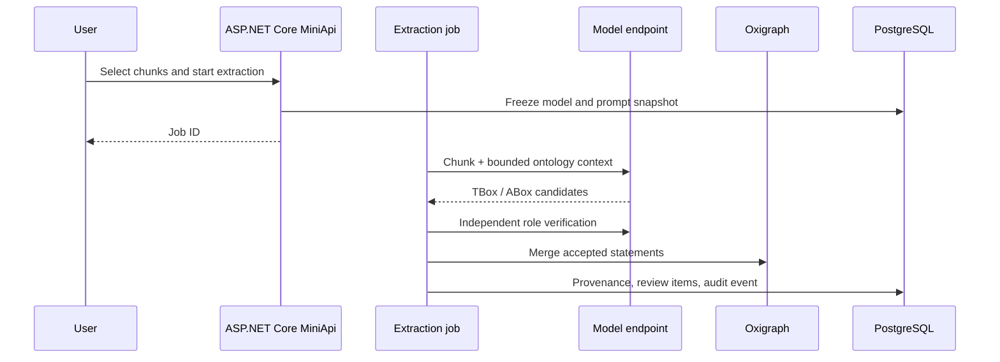

# Documents and extraction

The document workspace manages source material, parse results, chunk previews, and extraction jobs. Model services receive selected chunks and bounded ontology context only.

## Sources and storage

PDF, Word, Excel, Markdown, CSV, text, and RDF sources are supported. Raw bytes enter content-addressed storage; identical blobs may be reused while each knowledge system retains its own document record, folder, and processing state.

## Extraction pipeline

```mermaid
sequenceDiagram
    participant U as User
    participant API as ASP.NET Core MiniApi
    participant J as Extraction job
    participant M as Model endpoint
    participant G as Oxigraph
    participant P as PostgreSQL
    U->>API: Select chunks and start extraction
    API->>P: Freeze model and prompt snapshot
    API-->>U: Job ID
    J->>M: Chunk + bounded ontology context
    M-->>J: TBox / ABox candidates
    J->>M: Independent role verification
    J->>G: Merge accepted statements
    J->>P: Provenance, review items, audit event
```

Candidate generators propose structure; independent critics classify reusable concepts versus identities; deterministic guards reject unsupported roles, literals, invalid endpoints, and XSD types.

Jobs update progress counters asynchronously. Capacity is scoped per model endpoint, keeping LLM, embedding, and provider limits independent.

Each job records model identity, effective prompt contents and SHA-256, source chunks, evidence spans, graph statements, and later review decisions.

## Ingestion Sources and Folders

An ingestion Source records where a document belongs; a virtual Folder organizes documents inside the knowledge system. They are independent: choosing a Source during upload does not change the current Folder, and moving a document between Folders does not change its Source.

The current UI exposes the passive `folder` Source kind. Each knowledge system starts with a default folder Source. Use the **Upload source** selector to choose another folder Source; when no Source is supplied by an API client, the server applies its default. The Documents view continues to use the virtual Folder path for browsing and moving files.

The Sources view shows the Source kind, sync status, last sync time, document counts, and recent runs. **Never synced** means no sync timestamp has been recorded; the Source creation time is not a sync time. Manual sync and push-token controls appear only when the server reports those capabilities for a Source. Folder Sources are passive and expose neither control. Only kinds registered by the server are offered for creation; this deployment currently registers only `folder`. Editors can explicitly reveal or rotate a supported push token; rotation immediately invalidates the previous token. For connector kinds that support full scans, missing-document reconciliation is based on a completed scan, not on a partial run. Viewer-specific UI verification remains outstanding.
