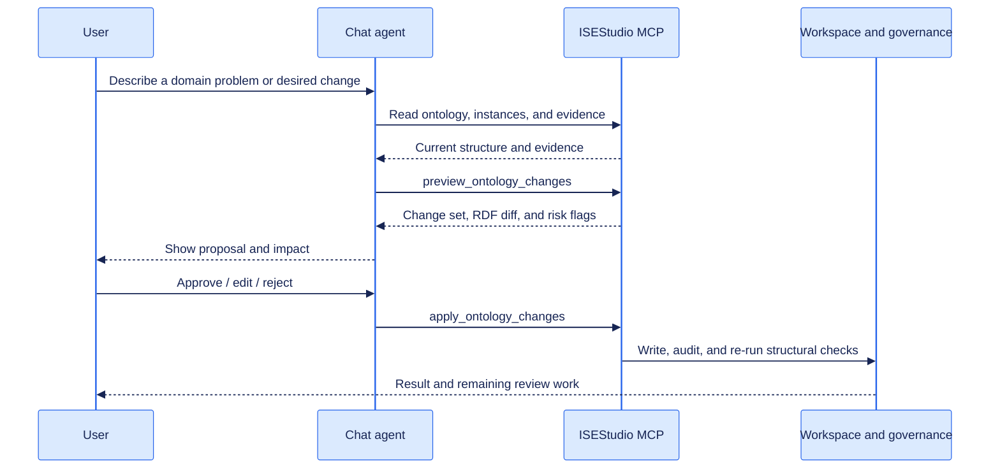

# MCP and agent integration

ISEStudio exposes Streamable HTTP MCP at `/mcp` in the backend lifecycle; no separate process is required. Each connection uses an MCP token bound to one user and one knowledge system. Every tool call re-evaluates that user's current role.

```mermaid
%%{init: {"theme":"base","themeVariables":{"primaryColor":"#dbeafe","primaryTextColor":"#172554","primaryBorderColor":"#2563eb","lineColor":"#3b82f6","secondaryColor":"#eff6ff","tertiaryColor":"#ffffff","fontFamily":"Inter, ui-sans-serif, system-ui"}}}%%
flowchart LR
    U["User"] --> C["Chat or MCP client"]
    C -->|"Bearer MCP token"| M["/mcp"]
    M --> A["Validate user, workspace, and live role"]
    A --> T["Read / propose / mutate / govern tools"]
    T --> W["Mutable workspace"]
    W --> Q["Validation, conflicts, and review"]
    Q --> R["Separate release"]
```



## Create a user MCP token

While signed in, call:

```http
POST /api/knowledge/{ks_id}/mcp/tokens
Content-Type: application/json

{
  "name": "Ontology chat",
  "scopes": ["mcp:read", "mcp:write"],
  "expires_in_minutes": 60
}
```

The `token` secret is returned once. It contains neither the password nor browser session and is valid only for the selected knowledge system. Expiration, revocation, user deactivation, member removal, and role changes take effect immediately.

| Method | Path | Purpose |
| --- | --- | --- |
| `GET` | `/api/knowledge/{ks_id}/mcp/tokens` | List the current user's tokens and status |
| `POST` | `/api/knowledge/{ks_id}/mcp/tokens` | Create a token; the secret is returned once |
| `DELETE` | `/api/knowledge/{ks_id}/mcp/tokens/{token_id}` | Revoke a token immediately |

## Scopes and roles

Token scopes and the live knowledge-system role both apply; effective permission is their intersection.

| Scope | Minimum role | Capability |
| --- | --- | --- |
| `mcp:read` | Viewer | Read ontology, vocabulary, instances, evidence, queues, history, and releases |
| `mcp:write` | Editor | Apply content changes, decide reviews, and start extraction |
| `mcp:manage` | Owner | Publish, roll back, stop services, and perform high-risk lifecycle actions |

Do not give an agent the browser's HttpOnly cookie or place an MCP token in prompts or source code. Inject it through the request header:

```http
Authorization: Bearer opm_<public-id-prefix>_<secret>
```

## Client registration

Client configuration formats vary, but the essential values are:

```json
{
  "mcpServers": {
      "isestudio": {
      "type": "streamable-http",
      "url": "http://localhost:8080/mcp",
      "headers": {
        "Authorization": "Bearer ${ISESTUDIO_MCP_TOKEN}"
      }
    }
  }
}
```

Set `MCP_PUBLIC_URL`, for example `https://knowledge.example.com/mcp`, when a reverse proxy exposes a different public address.

## Tools

### Reading and evidence

| Tool | Purpose |
| --- | --- |
| `get_workspace_context` | Workspace, live role, statistics, and governance blockers |
| `get_ontology` / `search_ontology` | Read or search the TBox |
| `list_documents` | Source documents and processing state |
| `list_vocabulary_concepts` / `resolve_term` | Browse and resolve controlled terms |
| `list_individuals` / `get_individual` | Instances, assertions, and source evidence |
| `query_knowledge` | Bounded read-only SPARQL `SELECT` / `ASK` |
| `list_review_items` | Conflicts, entity resolution, terminology, and validation queues |
| `get_history` / `list_releases` | Audit history and release state |

### Proposals and mutations

| Tool | Purpose |
| --- | --- |
| `preview_ontology_changes` | Validate structured edits and return an exact RDF diff without saving |
| `apply_ontology_changes` | Atomically apply TBox edits with actor, reason, and diff audit |
| `apply_instance_change` | Create/delete individuals and add/remove assertions |
| `apply_vocabulary_change` | Manage SKOS schemes and concepts |
| `decide_review_item` | Decide any of the four governance queues |
| `start_extraction` | Start TBox, ABox, or combined extraction |

### Lifecycle

| Tool | Purpose |
| --- | --- |
| `manage_release` | Create, review, publish, deploy, stop, roll back, or delete a release |
| `rollback_history_event` | Reverse one rollbackable audit event |

## Conversational ontology editing

The chat UI should not let a model compose arbitrary RDF or call arbitrary URLs. The agent follows a structured evidence → proposal → preview → user approval → execution loop.



## Mutation boundaries

- Preview runs inside graph write locks and fully reverts temporary changes.
- A TBox batch is one change set; an invalid operation aborts the graph mutation.
- Delete, merge, publish, rollback, stop, and release deletion require explicit confirmation.
- Mutations target the mutable workspace; published releases remain immutable.
- Graph writes that conflict with an active extraction are rejected.
- Successful writes record the real user, MCP source, reason, and rollbackable RDF diff.

A future chat frontend can mint a short-lived token per conversation. The model sees tool schemas and results; a trusted client or server execution layer injects the bearer secret.
