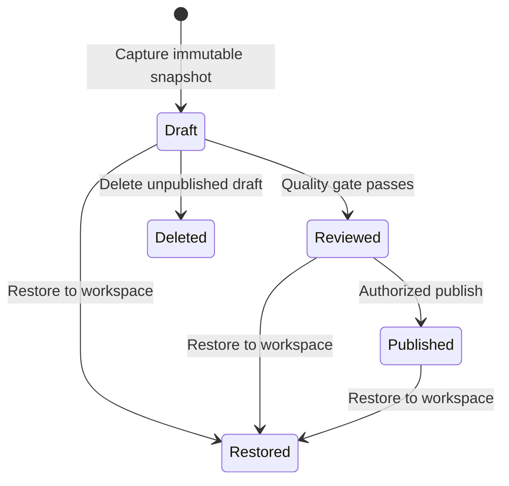
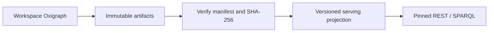

# Release lifecycle

Publishing converts a changing workspace into an immutable, verifiable, independently served version. Release state and deployment state are separate.

A formal version number is consumed only after successful publication. Deleting an unpublished draft does not consume `v1`, `v2`, or later numbers.

## Snapshot contents

Each release freezes TBox, SKOS, ABox, statement provenance, effective prompts and hashes, quality-gate results, file lists, statement counts, and SHA-256 digests.

Semantic diffs report additions and removals separately for ontology, vocabulary, and instances.

Pinned URLs use immutable cache semantics; `published` points to the latest release. Serving can stop and rebuild without changing the release record. Terminal deletion clears projections and artifacts while retaining tombstones and audit evidence.

ABox export streams uncompressed, fixed-statement-count N-Quads shards rather than materializing the entire graph in process memory.
