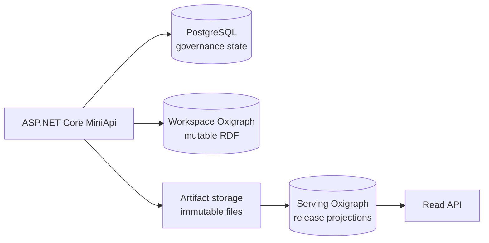

# Data and storage boundaries

Storage responsibilities do not overlap: RDF stores serve semantic queries, PostgreSQL holds governance state, and artifact storage holds immutable files.

| Store | Responsibility |
| --- | --- |
| PostgreSQL | Users, roles, documents, chunks, jobs, prompt snapshots, review, provenance, audit, tokens, releases, exports |
| Workspace Oxigraph | Mutable TBox, SKOS, and ABox named graphs per knowledge system |
| Serving Oxigraph | Version-isolated projections used by external read APIs |
| Artifact storage | Source blobs, snapshots, manifests, provenance JSONL, and N-Quads shards |

Source blobs are content-addressed. Identical bytes may share storage while knowledge systems keep separate document records and permissions.

Local development falls back to SQLite when `ISEStudio__Persistence__ConnectionString` is unset. Shared and production environments should use PostgreSQL and back up both Oxigraph stores, PostgreSQL, source files, artifacts, token keys, and deployment configuration together.
