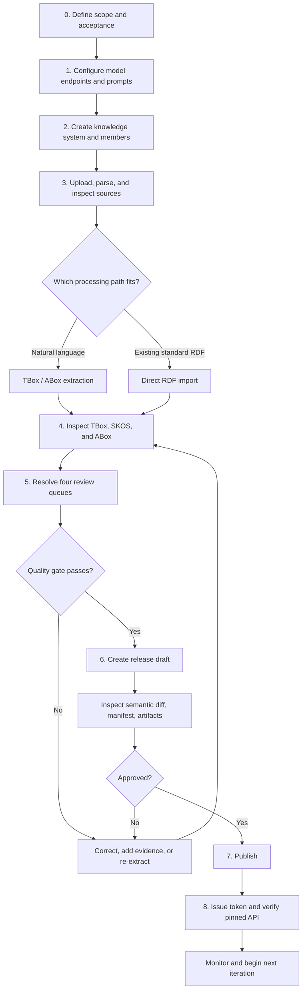
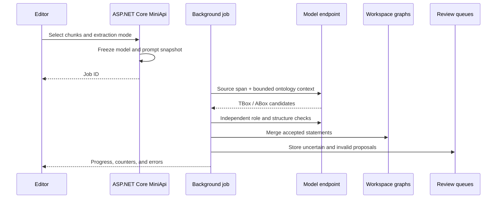

# Recommended workflow

This is an executable runbook from raw sources to a production knowledge service. Each phase defines its inputs, actions, checks, outputs, and fallback path so ungoverned model results never flow directly into business applications.

## End-to-end flow



## Before starting: define success

Record the business scope, required knowledge layers, authoritative sources, acceptance measures, consumption method, and accountable reviewers before uploading files.

| Decision | Question | Example |
| --- | --- | --- |
| Scope | Which processes or concept domains are in this iteration? | Pump operations only; procurement excluded |
| Layers | TBox only, or vocabulary and instances too? | TBox + SKOS + critical ABox records |
| Authority | Which source wins when documents disagree? | Standard > design manual > field note |
| Acceptance | How will the team judge usability? | Core coverage, isolated-class ratio, cleared queues |
| Delivery | How will clients consume the result? | Pinned REST + read-only SPARQL |
| Ownership | Who models, reviews, and publishes? | Editor, domain reviewer, Owner |

Keep an iteration small enough to review completely. A closed, evidence-backed loop is more valuable than a large unreviewed import.

## Role allocation

| Role | Main responsibility |
| --- | --- |
| Owner | Members, tokens, publishing, and high-risk lifecycle operations |
| Editor | Documents, extraction, ontology, vocabulary, instances, and review |
| Viewer / domain expert | Inspect structure and evidence; provide business judgment |
| Application owner | Define queries and validate the pinned release interface |

## Phase 1: configure models and prompts

1. Create separate LLM and embedding endpoints under **Settings → Model endpoints**.
2. Test URL, credentials, and model identity.
3. Set concurrency independently for every connected service.
4. Confirm Docker `SYSTEM_LANGUAGE`; it controls built-in model prompts, not UI language.
5. Override project prompts only when a concrete domain requirement exists.

Before continuing, connection tests should pass, endpoint capacity should be isolated, prompt language should fit the sources, and credentials should remain server-side.

Extraction jobs freeze model identity, effective prompt contents, and SHA-256 at start. Later configuration changes affect future jobs only.

## Phase 2: create the knowledge system

Create the workspace, describe its governed scope, select a stable Base IRI, and assign Editors and Viewers. A production Base IRI should be controlled by the organization and must not include temporary environment or personal names.

If continuing an existing system, first inspect history, open review items, running jobs, and the latest release.

## Phase 3: ingest and inspect sources

Use folders to distinguish standards, manuals, reports, historical versions, and supporting material. After parsing, sample chunk previews before extraction.

Check that headings, paragraphs, lists, and tables remain in useful order; chunks retain enough context; repeated headers and footers do not dominate; critical definitions appear; and language encoding is correct.

| Source | Recommended path |
| --- | --- |
| Standards, manuals, reports | Intelligent extraction |
| Turtle, RDF/XML, JSON-LD, or other RDF | Direct RDF import |
| Concrete rows in CSV or tables | ABox-focused extraction |
| Glossaries and synonym lists | Vocabulary governance |

The phase output is a selected, quality-checked batch with explicit source authority.

## Phase 4: extract or import in batches



Choose TBox-only for reusable schema, ABox-only when a stable schema already exists, combined extraction for a new mixed domain, and direct import for existing semantic data.

Start with 3–10 representative chunks, inspect role separation, correct endpoint or prompt problems, expand to one complete document, and only then process a homogeneous batch. Do not change model, prompt, document type, and extraction mode at the same time.

While a job runs, watch processed chunks, class/assertion deltas, file-specific failures, unknown classes, and the size of resolution queues.

## Phase 5: inspect all three layers

### TBox

Confirm core classes, labels, definitions, hierarchy, property roles, domains, and ranges. Look specifically for identities or literals promoted to classes, non-`is-a` relations represented as subclasses, isolated classes, and overly generic parents.

### SKOS

Review preferred labels, aliases, abbreviations, languages, broader concepts, ontology mappings, standalone terms, and origin metadata.

### ABox

Check identity splits and merges, most-specific supported types, object targets, data values and datatypes, and statement-level evidence.

The output should be an understandable, traceable workspace whose remaining uncertainty is represented explicitly in review queues.

## Phase 6: resolve review queues

Process conflicts first, then entity resolution, terminology proposals, and finally ABox validation. This order reduces repeated decisions caused by earlier structural changes.

| Queue | Release blocker |
| --- | --- |
| Conflicts | Unresolved error-level conflicts |
| Entity resolution | Any pending item |
| Terminology | Any pending proposal |
| ABox validation | Error-level validation items |

Record enough rationale for a later reviewer to understand why a proposal was accepted or dismissed.

Correct isolated issues directly. If the same error repeats across many chunks, stop scaling the batch, correct the prompt, model, or parsed input, and validate again on a small sample.

## Phase 7: create and review a release draft

Before draft creation, ensure quality gates pass, no job is writing the same scope, statistics match acceptance goals, critical entities have been sampled, and the change description is understandable.

During review, inspect:

1. semantic additions and removals separately for TBox, SKOS, and ABox;
2. quality-gate results and blocker counts;
3. manifest metadata, statement counts, and file list;
4. SHA-256 for every artifact;
5. sample provenance in the captured release.

If review fails, return to the workspace and create or update the draft after correction. A formal version number is consumed only by successful publication; deleting an unpublished draft does not consume `v1` or `v2`.

## Phase 8: publish, authorize, and accept

The Owner publishes the approved snapshot. OntoPilot verifies artifacts and loads a version-scoped projection into serving Oxigraph.

Issue a separate least-privilege token per client: `ontology:read`, `vocabulary:read`, `instances:read`, `query:read`, and optional `provenance:read` only as required.

Verify at least ontology retrieval, a known-term resolution, the release manifest, and any application-critical SPARQL query. Production clients should use `/releases/<version>`; use `/published` only when following the latest release is intentional.

```bash
curl -H "Authorization: Bearer $ONTOPILOT_TOKEN" \
  "$ONTOPILOT_BASE/ontology"

curl -H "Authorization: Bearer $ONTOPILOT_TOKEN" \
  "$ONTOPILOT_BASE/manifest"
```

## Failure and fallback guide

| Symptom | Inspect first | Recommended response |
| --- | --- | --- |
| Garbled or disordered parsing | Format, encoding, parse preview | Repair source or parser input before extraction |
| Empty extraction | Endpoint, model response, chunk content | Retry a representative small sample |
| Identities promoted into TBox | Role checks, prompts, field evidence | Stop the batch, correct, and re-extract |
| Review queue spike | Recent job, model, prompt change | Filter by job/time and isolate the change |
| Quality gate fails | Blockers in all four queues | Resolve queues; do not bypass the gate |
| Release API returns 503 | Projection provisioning | Honor `Retry-After` and inspect deployment |
| Pinned API returns 410 | Stopped service or deleted version | Rebuild service or select a valid release |
| New release behaves incorrectly | Semantic diff and acceptance queries | Keep clients pinned to the prior version and publish a correction |

Published versions are never edited in place. Correct the workspace and publish a new version so historical results remain reproducible.

## Iteration completion checklist

- [ ] Scope, source authority, and acceptance criteria are recorded.
- [ ] Model endpoints pass tests and have endpoint-specific limits.
- [ ] Parsed chunks have been sampled.
- [ ] TBox, SKOS, and ABox roles are correct.
- [ ] Critical statements link to source evidence.
- [ ] Four review queues satisfy quality gates.
- [ ] Semantic diff, manifest, and SHA-256 values are checked.
- [ ] A pinned release is active.
- [ ] Tokens follow least privilege and are isolated per client.
- [ ] REST, terminology, manifest, and critical queries pass acceptance.
- [ ] Downstream systems record the exact version they use.

Prefer short iterations of source batch → extraction → layered inspection → review → release. Change few variables per iteration and keep downstream systems pinned to the previous accepted version until the new release passes interface validation.
