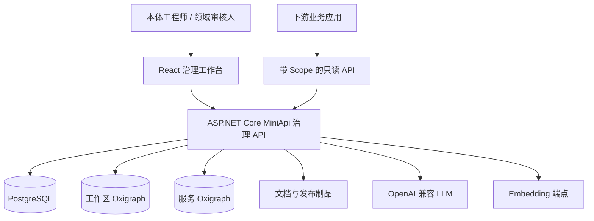
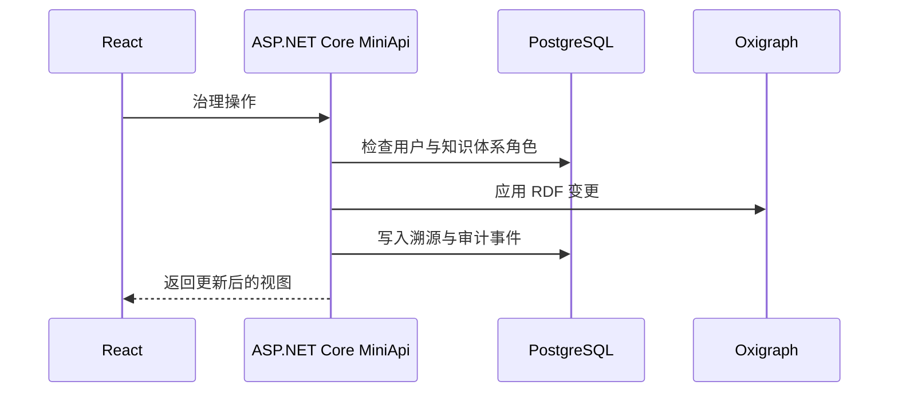

# 系统架构

React 工作台负责交互，ASP.NET Core MiniApi 负责治理和服务边界；关系元数据、RDF 图和不可变制品各自进入适合的存储。

## 写入路径

浏览器会话调用治理 API；后台任务访问模型端点；通过判定的语句写入工作区 Oxigraph，同时在 PostgreSQL 写入任务、证据、审阅项和审计事件。

## 读取路径

内部 UI 按 Owner、Editor、Viewer 角色读取工作区。机器 Token 只能调用独立的只读路由。固定版本路由只访问服务 Oxigraph 中的发布投影，不会穿透到可变工作区。

## 关键边界

- 浏览器 Cookie 会话与机器 Token 分离；
- 工作区图与发布服务图分离；
- TBox、SKOS、ABox 使用独立命名图；
- 模型只获得选中 chunk 与有界上下文；
- 图变更与发布行为必须留下审计记录。
