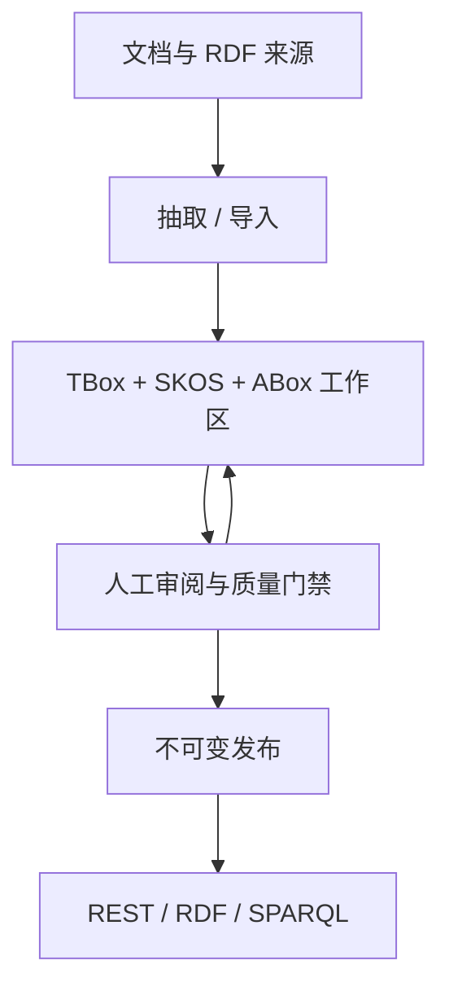

# 功能地图

ISEStudio 的页面不是孤立工具，每项能力都围绕“来源 → 候选 → 审阅 → 发布 → 消费”这条治理链工作。

| 领域 | 能力 | 主要产物 |
| --- | --- | --- |
| 文档接入 | PDF、Word、Excel、Markdown、CSV、文本；文件夹；批量解析；结构化分块 | Document、Chunk、Blob |
| TBox 抽取 | 类、属性、上下位、互斥、等价、定义域、值域、注释 | OWL/RDFS 语句 |
| ABox 抽取 | 实例、类型、对象断言、数据断言、实体消歧 | 实例与事实 |
| 受控术语 | SKOS 词表、多语言标签、别名、层级、本体映射 | ConceptScheme、Concept |
| 人工审阅 | 冲突、实体消歧、术语提案、ABox 验证 | 审核决定与理由 |
| 治理 | 成员角色、提示词、历史、溯源、审计、回滚 | 可解释变更记录 |
| 发布 | 草稿、审核、发布、语义 Diff、恢复、独立服务投影 | 不可变 Release |
| 导出 | TBox、词表、ABox 分层导出，N-Quads 分片与校验和 | Manifest 与制品文件 |
| 对外服务 | 每库 Token、Scope、REST、RDF、只读 SPARQL | 稳定读取接口 |
| 互操作 | RDF 直接导入，自动或显式拆分 TBox/ABox | 标准 RDF 图 |

## 功能之间如何协作

所有写入型能力服务于工作区治理；所有生产读取能力应优先面向发布版本。这个边界避免探索性修改直接影响业务应用。
