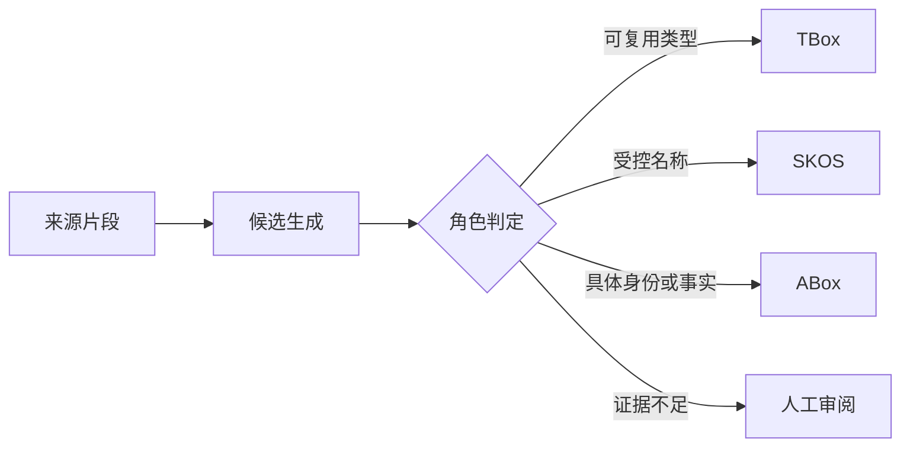

# 核心概念

三层知识模型是 ISEStudio 最重要的设计边界。相似的词不一定属于同一层，正确分层决定后续审阅、查询和发布是否可靠。

## TBox：可复用的概念结构

TBox 保存类、对象属性、数据属性和模式公理，例如：

- “泵”是一个类；
- “安装于”是对象属性；
- “额定功率”是数据属性；
- “离心泵是泵的子类”是上下位公理。

TBox 不应包含具体设备编号、某个地点、一次性事件或字面量值。

## SKOS：受控术语

术语层管理首选词、别名、隐藏检索词、多语言标签和词汇层级。术语可以映射到 TBox 实体，也可以作为独立领域词存在。

术语治理解决的是“怎么称呼和检索”，本体治理解决的是“它在概念结构中是什么”。两层可以同步，但不能混为同一份数据。

## ABox：实例与事实

ABox 保存具体身份和断言。例如 `Orion-7` 是某台泵，`Orion-7 安装于 Site-A` 是关于该实例的事实。实例通过类型和属性 IRI 与 TBox 连接，但存储在独立命名图中。

## 边界判定

结构化字段中的名称、编号、地点、组织、产品和一次性事件，不会因为首字母大写或带有类型词就自动成为类。候选生成器、独立角色判定器与确定性守卫会共同检查该边界。

| 文本 | 正确层 | 说明 |
| --- | --- | --- |
| Pump | TBox | 可复用设备类型 |
| Orion-7 | ABox | 具体设备身份 |
| centrifugal pump / 离心泵 | SKOS + TBox 映射 | 术语映射概念 |
| 42.5 kW | ABox 字面量 | 数据属性值 |
