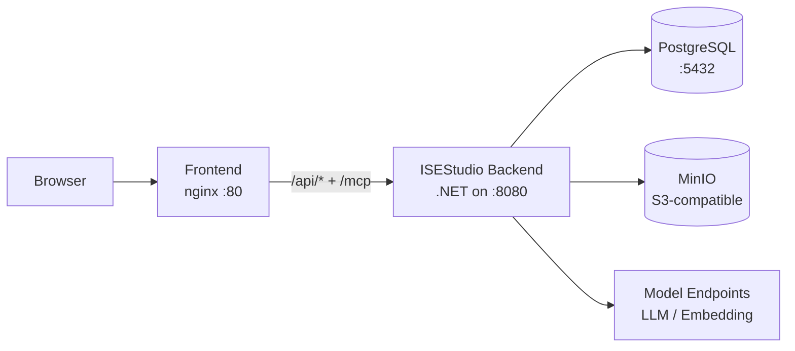

# Docker 与配置

Docker Compose 提供 PostgreSQL、ISEStudio .NET 后端、MinIO(S3 兼容制品存储)和 React 前端的基础部署。模型端点、提示词与系统语言可以独立配置。

## 启动顺序

```bash
# 1. 复制两份 .env 模板
cp src/.env.example src/.env
cp .env.example .env

# 2. 在根 .env 里设置强 POSTGRES_PASSWORD + MINIO_ACCESS_KEY + MINIO_SECRET_KEY
$EDITOR .env

# 3. 在 src/.env 里至少设置 SEED_ADMIN_USERNAME + SEED_ADMIN_PASSWORD(密码 ≥ 12 字符)
$EDITOR src/.env

# 4. 引导第一个 admin(等同迁移;bootstrap profile 不参与默认启动)
docker compose --profile bootstrap run --rm seed-admin

# 5. 拉起完整栈(migrate 容器会自动跑 schema 迁移,然后 backend 启动)
docker compose up -d --build
```

首次启动流程分四步,顺序不可乱:

| 阶段 | 谁来跑 | 目的 |
| --- | --- | --- |
| migrate | `isestudio-migrate` 容器(随 `up -d` 自动跑一次) | 应用 EF Core schema 迁移,创建所有表 |
| seed-admin | `--profile bootstrap run --rm seed-admin` | 在 `users` 表写入第一个 admin;凭证通过 `SEED_ADMIN_USERNAME` / `SEED_ADMIN_PASSWORD` env 传入 |
| backend | `isestudio` 容器 | `BootstrapAdminService` 启动期校验 `users` 非空 → 通过 → 监听 :8080 |
| frontend | `frontend` 容器 | nginx 反向代理 `:80` → backend `isestudio:8080` |

> `seed-admin` 通过 `src/.env` 读凭证而不是 CLI 参数,所以密码不会出现在 `docker compose ps` 输出或 shell history。该命令是**幂等**的 —— 已有同名 admin 时直接 exit 0,不会重复写入。
>
> 如果只想用 SQL 手工 INSERT(只接触得到 postgres 容器,backend 镜像不可用的极端场景),按 [`docs/superpowers/runbooks/2026-08-25-fresh-deployment-bootstrap.md`](../../../../../docs/superpowers/runbooks/2026-08-25-fresh-deployment-bootstrap.md)(283 行,含混合大小写列名 + BCrypt 跨语言 hash 生成)走。**这是兜底路径,默认走 `seed-admin`。**



修改后端配置后,只需重建 `isestudio` 容器:

```bash
docker compose up -d isestudio
```

## 系统语言

```dotenv
SYSTEM_LANGUAGE=zh-CN
```

允许值为 `zh-CN` 或 `en`。该值决定**内置模型提示词**使用中文还是英文,与用户在前端切换的界面语言无关。知识体系自定义提示词优先,且不会被系统语言变更覆盖。

根目录 `.env` 里改完 `SYSTEM_LANGUAGE` 之后,重建后端即可生效:

```bash
docker compose up -d isestudio
```

(`SYSTEM_LANGUAGE` 由 docker-compose.yml 插值成 `ISEStudio__SystemLanguage` 注入 `isestudio` 容器;`src/.env` 不需要重复声明。)

## 模型端点

每个接入服务独立设置地址、模型、密钥和并发上限。容量按端点隔离,因此 LLM、Embedding 或多个供应商可以分别调优,不使用容易产生歧义的全局限流。未配置模型凭据时,界面与不依赖模型的功能仍可启动;依赖 LLM 的抽取 / 嵌入 / 术语建议等管线会按设计 fail-closed 报缺失。

## 提示词

管理员可以查看系统内置定义,知识体系可以覆盖单个提示词。每次抽取任务保存实际生效的全文和 SHA-256,便于审计与复现。内置提示词文案随 `SYSTEM_LANGUAGE` 切换,但 SHA-256 不计入 —— 用户覆写后永远生效。

## 服务清单

| Compose service | 镜像 / 来源 | 暴露 | 角色 |
| --- | --- | --- | --- |
| `postgres` | `postgres:16-alpine` | `:5432`(host 可选) | 主存储(users / KS / chunks / 审计等) |
| `minio` | `minio/minio:latest` | `:9000-9001`(host 可选) | S3 兼容对象存储(RDF import / 导出制品) |
| `isestudio-migrate` | `isestudio-backend`(同 image,不同 entrypoint) | 不暴露 | 一次性 EF Core schema 迁移(Exited 0) |
| `isestudio-seed-admin` | `isestudio-backend`(`--profile bootstrap` 启用) | 不暴露 | 一次性 admin 注入;只在 §1 步骤 4 跑 |
| `isestudio` | `isestudio-backend` | intra-net `:8080`(走 frontend nginx 暴露到 host) | 主后端进程 |
| `frontend` | `ontopilot-frontend`(本地 build) | `:8080→:80`(由 `ISESTUDIO_PORT` 控制) | nginx SPA + 反向代理 `/api/*` `/mcp` |

容器名遵循 `<project-prefix>_<service>-<index>`,默认 project prefix = `docker-compose.yml` 所在目录名,即 `ontopilot_*`(`ontopilot-postgres-1`、`ontopilot-isestudio-1`、`ontopilot-frontend-1` 等)。如果用 `COMPOSE_PROJECT_NAME` 显式覆盖,容器名前缀随之改变。

## 生产检查清单

- 启用 HTTPS 与 `ISEStudio__CookieSecure=true`(cookie 名 `isestudio_session`,默认 `secure=false` 在 dev 下);
- 改掉默认 admin 密码,创建第二个 admin 防止单点丢失;
- 修改 `POSTGRES_PASSWORD` / `MINIO_ACCESS_KEY` / `MINIO_SECRET_KEY` 为强随机值;
- 备份 PostgreSQL + MinIO bucket(`isestudio-data` / `isestudio-minio` 两个 docker volume);
- 保存 token 加密密钥并建立恢复流程;
- 反向代理设置请求大小、超时、限流和访问日志(frontend nginx 默认 `proxy_read_timeout 300s` 用于长任务轮询);
- 为 `/api/health` 和关键后台任务建立监控;
- 升级前跑后端测试 + 前端构建 + `docker compose config --quiet`(必须 exit 0);
- 首次部署务必走 §1 启动顺序的 5 步,而不是直接 `up -d` —— 否则 backend 会因空 `users` 表 exit 17,触发 runbook 兜底路径。
