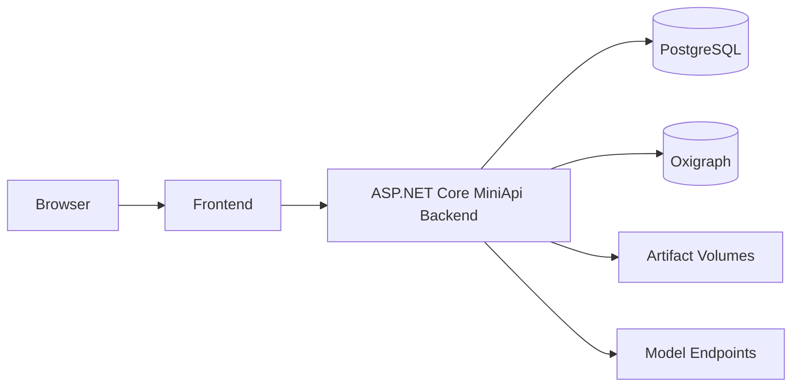

# Docker 与配置

Docker Compose 提供 PostgreSQL、ASP.NET Core MiniApi 后端和 React 前端的基础部署。模型端点、提示词与系统语言可以独立配置。

## 启动

```bash
cp src/.env.example src/.env
cp .env.example .env
docker compose up -d --build
```

首次启动前，请在 `.env` 设置强 `POSTGRES_PASSWORD`，并通过
`docker compose --profile bootstrap run --rm seed-admin` 完成首次引导，密码至少 12 个字符。
凭据为空或仍为公开示例值时，系统会主动终止初始化，不会创建弱口令管理员。

还应配置至少一个可用的模型端点；未配置模型凭据时，界面与不依赖模型的功能仍可启动。



## 系统语言

```dotenv
SYSTEM_LANGUAGE=zh-CN
```

允许值为 `zh-CN` 或 `en`。该值决定**内置模型提示词**使用中文还是英文，与用户在前端切换的界面语言无关。知识体系自定义提示词优先，且不会被系统语言变更覆盖。

修改根目录 `.env` 后，重新创建后端容器即可生效：

```bash
docker compose up -d backend
```

## 模型端点

每个接入服务独立设置地址、模型、密钥和并发上限。容量按端点隔离，因此 LLM、Embedding 或多个供应商可以分别调优，不使用容易产生歧义的全局限流。

## 提示词

管理员可以查看系统内置定义，知识体系可以覆盖单个提示词。每次抽取任务保存实际生效的全文和 SHA-256，便于审计与复现。

## 生产检查清单

- 启用 HTTPS 与 `OnToPilot__CookieSecure=true`；
- 修改默认管理员与数据库密码；
- 配置 PostgreSQL、Oxigraph 和制品卷备份；
- 保存 Token 加密密钥并建立恢复流程；
- 在反向代理设置请求大小、超时、限流和访问日志；
- 为 `/api/health` 和关键后台任务建立监控；
- 升级前运行后端测试和前端构建。
