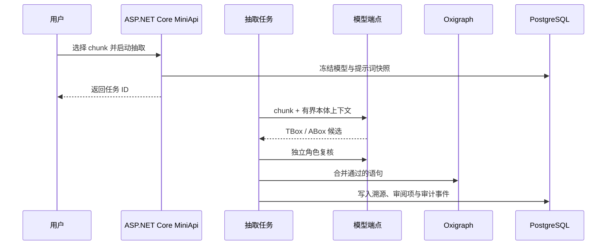

# 文档与抽取

文档页管理源材料、解析结果、chunk 预览和抽取任务。模型只接收用户选中的 chunk 与有界本体上下文。

## 支持的来源

- PDF、Word、Excel；
- Markdown、CSV、纯文本；
- 直接导入的 RDF 文件；
- 文件夹组织与批量解析。

源文件首先进入内容寻址存储。相同字节可以复用底层 Blob，但每个知识体系仍保留自己的文档记录、文件夹位置和处理状态。

## 抽取流水线

## 角色判定与守卫

第一阶段只负责提出候选，独立判定器负责区分可复用概念、受控名称、具体身份和字面量。随后，确定性守卫检查 XSD 类型、缺失端点、非法角色和不受证据支持的结构。

## 任务与并发

抽取作为后台任务运行，持续更新已处理 chunk、类、断言和错误统计。并发容量按模型端点分别管理，因此 LLM 与 Embedding，或多个供应商之间不会共享一个模糊的全局限流器。

## 可复现性

每个任务保存：

1. 模型端点与模型标识；
2. 实际生效的提示词全文；
3. 提示词 SHA-256；
4. 源文档、chunk 与证据片段；
5. 写入的语句和后续审阅决定。

编辑提示词只影响未来任务，不会改写历史任务的解释依据。
