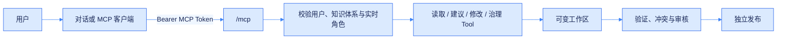
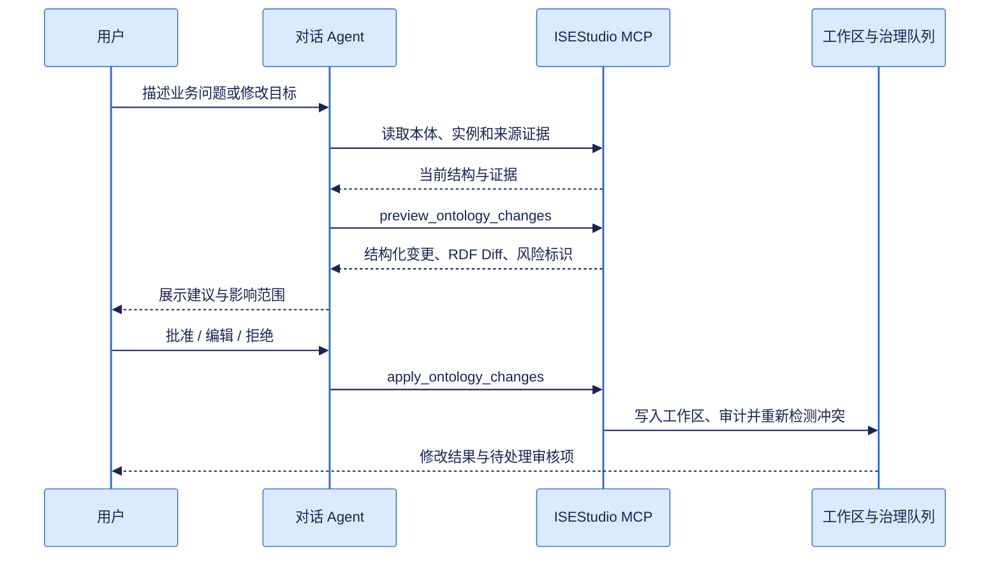

# MCP 与 Agent 集成

ISEStudio 在 `/mcp` 提供 Streamable HTTP MCP。它与后端使用同一个启动周期，不需要部署额外进程。每个连接使用一个绑定到“用户 + 知识体系”的 MCP Token，Agent 的每次调用都以该用户身份重新检查当前角色。



## 创建用户 MCP Token

登录后调用：

```http
POST /api/knowledge/{ks_id}/mcp/tokens
Content-Type: application/json

{
  "name": "Ontology chat",
  "scopes": ["mcp:read", "mcp:write"],
  "expires_in_minutes": 60
}
```

响应中的 `token` 只返回一次。Token 不保存用户密码或浏览器会话，并且只对创建时选择的知识体系有效。过期、吊销、用户停用、成员移除或角色降低都会立即使不再允许的调用失败。

| 方法 | 路径 | 用途 |
| --- | --- | --- |
| `GET` | `/api/knowledge/{ks_id}/mcp/tokens` | 查看自己的 Token 与状态 |
| `POST` | `/api/knowledge/{ks_id}/mcp/tokens` | 创建 Token；密钥仅本次返回 |
| `DELETE` | `/api/knowledge/{ks_id}/mcp/tokens/{token_id}` | 立即吊销 Token |

## Scope 与用户角色

Token Scope 和知识体系角色会同时生效，最终权限取两者交集。

| Scope | 最低角色 | 能力 |
| --- | --- | --- |
| `mcp:read` | Viewer | 读取本体、词表、实例、来源、审核队列、历史与发布 |
| `mcp:write` | Editor | 应用本体、实例、词表修改，处理审核项，启动抽取 |
| `mcp:manage` | Owner | 发布、回滚、停止服务及其他高风险生命周期操作 |

不要把浏览器的 HttpOnly Cookie 交给 Agent，也不要把 MCP Token 写入提示词或源码。客户端应通过请求 Header 注入：

```http
Authorization: Bearer opm_<public-id-prefix>_<secret>
```

## 客户端注册

不同客户端的配置文件结构可能略有差异，核心参数如下：

```json
{
  "mcpServers": {
      "isestudio": {
      "type": "streamable-http",
      "url": "http://localhost:8080/mcp",
      "headers": {
        "Authorization": "Bearer ${ISESTUDIO_MCP_TOKEN}"
      }
    }
  }
}
```

反向代理部署时，用 `MCP_PUBLIC_URL` 设置对外地址，例如 `https://knowledge.example.com/mcp`。

## Tool 能力

### 读取与证据

| Tool | 用途 |
| --- | --- |
| `get_workspace_context` | 当前知识体系、用户角色、统计和治理阻塞项 |
| `get_ontology` / `search_ontology` | 读取或搜索 TBox |
| `list_documents` | 查看来源文档和处理状态 |
| `list_vocabulary_concepts` / `resolve_term` | 浏览与解析受控术语 |
| `list_individuals` / `get_individual` | 读取实例、断言与来源证据 |
| `query_knowledge` | 受限只读 SPARQL `SELECT` / `ASK` |
| `list_review_items` | 读取冲突、实体消歧、术语和验证队列 |
| `get_history` / `list_releases` | 读取审计历史与发布状态 |

### 建议与修改

| Tool | 用途 |
| --- | --- |
| `preview_ontology_changes` | 验证结构化修改并返回精确 RDF Diff，不保存 |
| `apply_ontology_changes` | 原子应用本体修改并记录用户、原因和 Diff |
| `apply_instance_change` | 创建/删除实例，增加/移除断言 |
| `apply_vocabulary_change` | 管理 SKOS 词表与概念 |
| `decide_review_item` | 处理四类审核队列 |
| `start_extraction` | 启动 TBox、ABox 或组合抽取 |

### 生命周期

| Tool | 用途 |
| --- | --- |
| `manage_release` | 创建草稿、审核、发布、部署、停止、回滚或删除发布 |
| `rollback_history_event` | 回滚一个可逆审计事件 |

## 对话式本体修改流程

前端对话不应让模型直接拼接 RDF 或调用任意 URL。Agent 应使用结构化 Tool 完成“读取证据 → 提建议 → 预览 → 用户确认 → 执行”的闭环。



## 修改安全边界

- 预览 Tool 会在图写锁内临时执行并完整回滚，不产生持久修改。
- 批量本体修改按一个变更集执行；任何操作无效都会撤销整个图修改。
- 删除、合并、发布、回滚、停止和删除发布要求显式确认参数。
- 修改只进入可变工作区；已发布版本保持不可变，发布是独立动作。
- 抽取运行期间会拒绝冲突的图写入，避免交叉修改。
- 所有成功写入都会记录真实用户、MCP 来源、原因和可回滚 RDF Diff。

对话前端可以为每次会话签发短期 Token，并把会话标识写入 Token 名称或修改原因。模型只看到 Tool Schema 和 Tool 结果，Bearer 密钥由受信任的客户端或服务端执行层注入。
