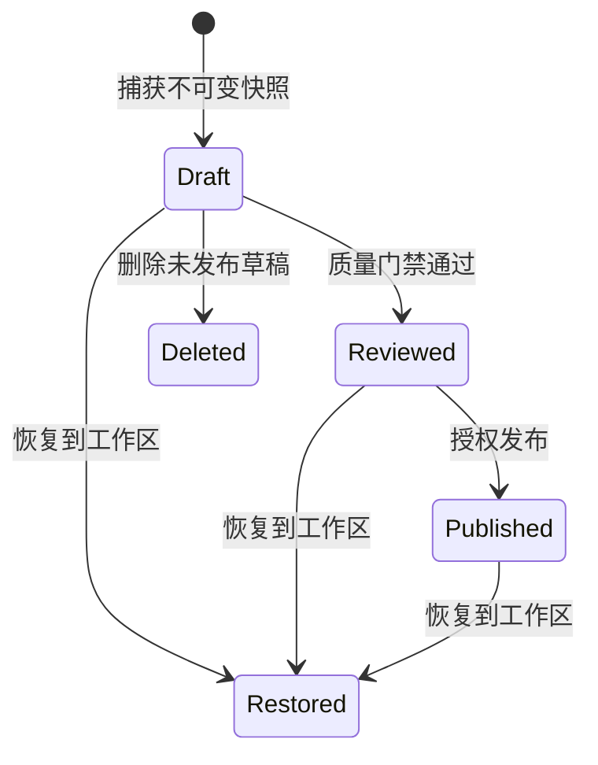
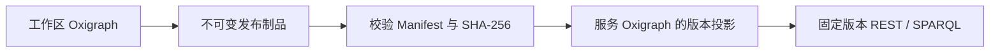

# 版本发布

发布把持续变化的工作区转换为不可变、可校验、可独立服务的版本。**发布状态**与**服务部署状态**彼此独立。

## 生命周期

正式版本号只在发布成功时占用。未成功发布便删除的草稿不会消耗 `v1`、`v2` 等版本号。

## 快照内容

每个发布版本固化：

- TBox、SKOS 与 ABox RDF；
- TBox/ABox 语句级溯源；
- 有效提示词及其 SHA-256；
- 质量门禁结果；
- 文件列表、语句数量和每个文件的 SHA-256。

## 语义 Diff

版本比较按 TBox、术语和 ABox 分层显示新增与删除，而不是只比较压缩包大小。这样可以区分概念结构变化、命名变化和实例事实变化。

## Release-as-a-Service

固定版本地址具有不可变缓存语义；`published` 别名指向最新发布。服务可以停止和重建而不改变发布记录。终态删除会清理投影和制品，但保留墓碑与审计证据。

## 导出设计

ABox 不会一次性加载到 .NET 进程内存，而是从 Oxigraph 流式写入固定语句数的未压缩 N-Quads 分片。未压缩格式支持逐行处理、HTTP Range、对象存储复制和分片重试；传输层仍可由反向代理启用压缩。
