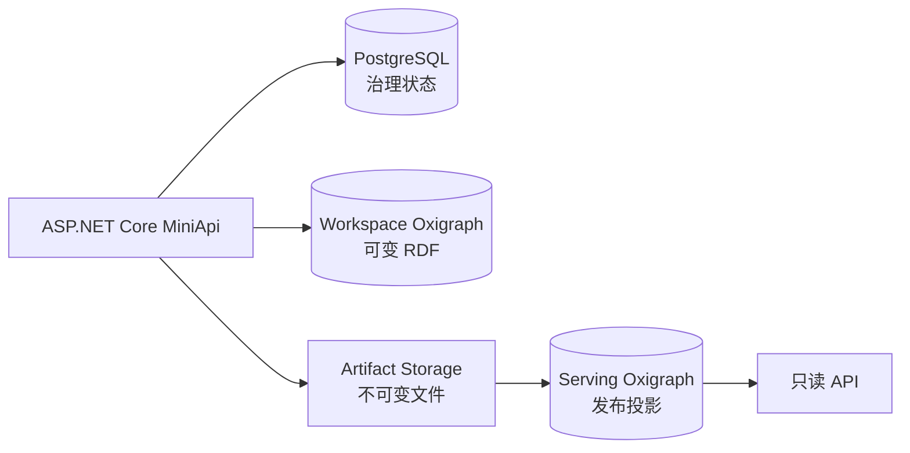

# 数据与存储边界

不同存储之间不做职责混用：RDF 图用于语义查询，关系库用于治理状态，制品目录用于不可变文件。

| 存储 | 职责 |
| --- | --- |
| PostgreSQL | 用户、角色、文档、chunk、任务、提示词快照、审阅队列、溯源、审计、Token、发布和导出元数据 |
| 工作区 Oxigraph | 每个知识体系的可变 TBox、SKOS 与 ABox 命名图 |
| 服务 Oxigraph | 按发布版本隔离、只供对外读取的投影图 |
| 制品存储 | 源 Blob、不可变发布快照、Manifest、溯源 JSONL 和 N-Quads 分片 |

## 内容寻址文件

源文件 Blob 以内容哈希寻址。相同字节可以复用存储，但每个知识体系保留独立的文档记录、文件夹和权限关系。

## 图的隔离

每个知识体系至少维护 TBox、Vocabulary 与 ABox 三个命名图。发布后又会创建带版本范围的服务图，因此发布查询不会读取工作区的后续修改。

## 本地与生产

本地开发在未设置 `DATABASE_URL` 时可回退到 SQLite。多人共享或生产部署应使用 PostgreSQL，并同时备份：

1. PostgreSQL；
2. 工作区 Oxigraph；
3. 服务 Oxigraph；
4. 源文件和发布制品；
5. Token 加密密钥与部署配置。
