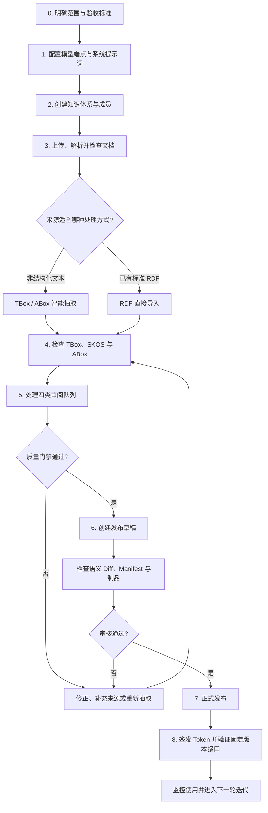
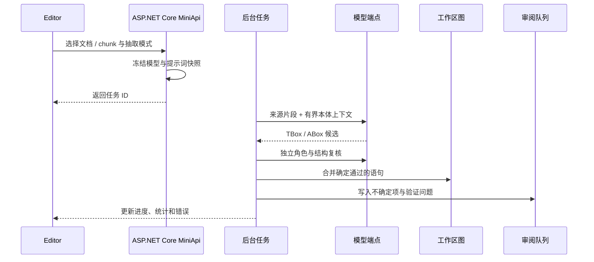

# 推荐工作流

这是一套从原始材料到生产知识服务的完整 Runbook。它不是要求所有项目机械地执行相同步骤，而是明确每个阶段的**输入、操作、检查点、产出和回退路径**，避免把尚未治理的模型结果直接交给业务应用。

## 全流程概览



## 开始前：先定义成功标准

在上传文件之前，先记录本轮建设的目标。缺少这一步时，团队通常会不断扩大抽取范围，却无法判断本体是否已经“足够好”。

建议至少明确：

| 项目 | 需要回答的问题 | 示例 |
| --- | --- | --- |
| 业务范围 | 本轮覆盖哪些流程、设备或概念域？ | 仅覆盖泵站运维，不覆盖采购与财务 |
| 交付层级 | 只需要 TBox，还是同时需要术语与实例？ | TBox + SKOS + 关键设备 ABox |
| 来源优先级 | 哪些文件是权威来源，冲突时以谁为准？ | 标准规范 > 设计手册 > 现场记录 |
| 验收指标 | 用什么判断结构可用？ | 核心类覆盖、孤立类比例、审阅队列清零 |
| 消费方式 | 下游如何读取？ | 固定版本 REST + 只读 SPARQL |
| 责任人 | 谁负责建模、领域审核与最终发布？ | Editor 建模、领域专家审核、Owner 发布 |

> 建议把一次迭代限制在可以完整审阅的范围内。小范围闭环通常比一次导入全部资料更快得到可信结果。

## 角色分工

| 角色 | 主要职责 | 不应承担的职责 |
| --- | --- | --- |
| Owner | 成员、Token、发布和高风险生命周期操作 | 不应绕过质量门禁直接交付 |
| Editor | 文档、抽取、本体、术语、实例和审阅操作 | 不应擅自改变业务验收范围 |
| Viewer / 领域专家 | 浏览结构、检查证据、反馈业务判断 | 不直接修改生产接口凭证 |
| 下游应用负责人 | 定义查询需求、验证固定版本接口 | 不依赖可变工作区作为生产数据源 |

## 阶段 1：配置模型与提示词

### 输入

- 可用的 OpenAI 兼容 LLM 服务；
- 如启用检索或语义匹配，还需要 Embedding 服务；
- 预期处理的语言、领域与文档规模。

### 操作

1. 在 **设置 → 模型端点** 中分别创建 LLM 和 Embedding 端点；
2. 测试连接、模型名称和凭据；
3. 根据服务配额为每个端点设置独立并发上限；
4. 确认 Docker 的 `SYSTEM_LANGUAGE`，它决定内置模型提示词使用中文还是英文；
5. 仅在确有领域要求时覆盖知识体系提示词，不要一开始就大范围改写。

### 检查点

- 连接测试成功；
- LLM 与 Embedding 没有错误共享同一个容量限制；
- 系统提示词语言与源文档、团队审核语言匹配；
- 凭据没有写入前端、文档或源码仓库。

### 产出

可被抽取任务引用的端点配置。任务启动后会冻结模型标识、有效提示词全文和 SHA-256，因此后续配置修改只影响新任务。

## 阶段 2：创建知识体系与协作边界

### 操作

1. 创建知识体系并填写清晰名称与描述；
2. 设置稳定的 Base IRI；
3. 添加 Editor 与 Viewer；
4. 在概览页确认当前知识快照为空或符合预期；
5. 如果从已有项目继续，先检查历史、开放审阅项和最近发布版本。

### Base IRI 选择原则

- 使用由团队控制、长期稳定的命名空间；
- 不要包含临时环境名、个人姓名或会频繁变化的目录；
- 进入生产后不要随意修改，否则新旧实体 IRI 会出现断裂。

### 产出

一个具有明确成员权限、图命名空间和治理范围的工作区。

## 阶段 3：接入和检查来源

### 3.1 上传与组织

使用文件夹区分标准、手册、报告、历史版本和辅助材料。文件夹是治理组织方式，不改变底层内容寻址存储。

### 3.2 解析与 chunk 检查

解析完成后不要立即全量抽取，先检查：

- 标题、段落、表格和列表是否保持合理顺序；
- chunk 是否过短而失去上下文，或过长而混入多个主题；
- 页眉、页脚、目录和重复模板是否产生噪声；
- 关键定义、约束和实例描述是否出现在预览中；
- 文档语言和字符编码是否正确。

### 3.3 选择处理方式

| 来源 | 推荐方式 | 原因 |
| --- | --- | --- |
| 规范、手册、报告、说明文本 | 智能抽取 | 需要从自然语言提出结构与事实候选 |
| 已有 Turtle、RDF/XML、JSON-LD 等 | RDF 直接导入 | 保留既有 IRI 与明确语义 |
| CSV / 表格中的具体记录 | 以 ABox 为主 | 行通常代表实例或观测值 |
| 术语表或同义词表 | 术语治理 | 重点是标签、别名、语言与映射 |

### 产出

一批已确认解析质量、具有明确权威等级并被选中用于本轮处理的 chunk 或 RDF 文件。

## 阶段 4：分批执行抽取或导入



### 抽取模式选择

- **仅 TBox**：来源主要描述类型、结构、约束和通用关系；
- **仅 ABox**：已有稳定本体，来源主要描述具体对象和事实；
- **TBox + ABox**：新领域首轮建设，来源同时包含概念与实例；
- **RDF 导入**：来源已经是结构化语义数据。

### 推荐批次策略

1. 先选择 3–10 个代表性 chunk；
2. 检查模型是否正确区分类、术语、实例和字面量；
3. 修正端点、提示词或来源噪声；
4. 再扩大到一个完整文档；
5. 最后执行同类型文档批次。

不要同时改变提示词、模型、文档类型和抽取模式，否则结果异常时很难定位原因。

### 运行中观察

- 已处理 chunk 是否持续增长；
- 类与断言新增数量是否异常为零或突然暴增；
- 错误是否集中在单一文件或端点；
- 未知类和待消歧实体是否超出可审阅范围。

## 阶段 5：检查三层知识模型

抽取完成不代表结果已经可以发布。应按层检查，而不是只看总数量。

### TBox 检查

- 核心类是否存在，标签和释义是否准确；
- 具体设备、编号、地点或字面量是否误入类；
- 上下位是否表达 `is-a`，而不是 `part-of`、`uses` 或 `located-in`；
- 对象属性和数据属性是否选对角色；
- 定义域和值域是否过宽、过窄或互相冲突；
- 是否存在大量孤立类或不合理的“万能父类”。

### SKOS 术语检查

- 首选词是否稳定且符合团队命名规范；
- 别名、缩写和多语言标签是否进入正确字段；
- 本体映射是否指向正确实体；
- 独立领域术语是否被错误强制映射；
- 自动形成、人工创建和 AI 建议后确认的来源是否合理。

### ABox 检查

- 身份是否被错误拆分或合并；
- 类型是否选择最具体且有证据支持的类；
- 对象断言的目标是否真的是另一个实例；
- 数据断言的值与数据类型是否正确；
- 每个关键事实能否回到正确文档、chunk 和原文片段。

### 产出

结构上可理解、证据可追踪，并且问题已进入明确审阅队列的工作区状态。

## 阶段 6：处理四类审阅队列

建议按以下顺序处理，减少前一个决定对后续队列产生反复影响：

1. **冲突**：先处理重复类、结构矛盾和属性冲突；
2. **实体消歧**：再决定身份合并、同名对象和候选匹配；
3. **术语提案**：在实体结构稳定后审核别名、层级和映射；
4. **ABox 验证**：最后检查实例类型与断言合法性。

每个决定应填写足够理由，让未来审核人理解“为什么接受或忽略”，而不只是看到最终状态。

### 发布阻塞条件

| 队列 | 阻塞条件 |
| --- | --- |
| 冲突 | 存在未解决的 error 级冲突 |
| 实体消歧 | 存在待处理项 |
| 术语提案 | 存在待处理项 |
| ABox 验证 | 存在 error 级验证项 |

### 何时重新抽取

如果问题来自单个候选，直接编辑或审阅即可；如果同类错误在多个 chunk 重复出现，应停止扩大批次，修正提示词、模型或解析输入后重新运行小批验证。

## 阶段 7：创建和审核发布草稿

### 创建草稿前检查

- 四类队列满足质量门禁；
- 当前工作区没有正在写入同一范围的抽取任务；
- 知识统计与本轮验收目标一致；
- 关键实体、术语和实例已人工抽样；
- 本轮变更说明能够被团队理解。

### 审核草稿

重点检查：

1. **语义 Diff**：分别查看 TBox、SKOS、ABox 的新增与删除；
2. **质量门禁**：确认阻塞项数量和检查结果；
3. **Manifest**：确认版本元数据、语句数量和文件列表；
4. **制品校验**：确认每个文件都有 SHA-256；
5. **溯源**：抽样验证关键语句在发布快照中仍有来源。

审核不通过时，应返回工作区修正后重新创建或更新草稿，而不是依赖发布后临时修补。

> 正式版本号只在发布成功时占用。未发布便删除的草稿不会消耗 `v1`、`v2` 等编号。

## 阶段 8：发布、授权和验收

### 发布

Owner 执行正式发布。系统校验不可变制品，并将版本装载到独立的服务 Oxigraph 投影中。发布记录与服务部署状态分离，因此服务可以停止和重建而不修改版本内容。

### 签发 Token

为每个调用方创建独立 Token，只授予需要的 Scope：

- 只读本体：`ontology:read`；
- 术语解析：增加 `vocabulary:read`；
- 实例查询：增加 `instances:read`；
- SPARQL：增加 `query:read`；
- 需要证据时再增加 `provenance:read`。

### 接口验收

至少验证以下请求：

```bash
curl -H "Authorization: Bearer $ISESTUDIO_TOKEN" \
  "$ISESTUDIO_BASE/ontology"

curl -H "Authorization: Bearer $ISESTUDIO_TOKEN" \
  "$ISESTUDIO_BASE/vocabulary/resolve?q=<known-term>"

curl -H "Authorization: Bearer $ISESTUDIO_TOKEN" \
  "$ISESTUDIO_BASE/manifest"
```

生产应用应使用 `/releases/<version>` 固定版本地址。只有明确接受“随最新发布移动”时才使用 `/published`。

## 失败与回退路径

| 现象 | 优先检查 | 推荐动作 |
| --- | --- | --- |
| 解析内容乱码或顺序混乱 | 文件格式、编码、解析结果 | 修复来源或解析后重新选择 chunk |
| 抽取结果为空 | 端点连接、模型响应、chunk 内容 | 用少量代表性 chunk 重试 |
| 实例大量误入 TBox | 角色判定、提示词、来源字段 | 停止扩批并修正后重新抽取 |
| 审阅项突然暴增 | 最近批次、模型或提示词变化 | 按任务和时间筛选，定位变化来源 |
| 质量门禁不通过 | 四类队列的阻塞项 | 处理队列，不要绕过门禁 |
| 发布服务返回 503 | 部署仍在装载 | 按 `Retry-After` 重试并检查部署状态 |
| 固定版本返回 410 | 服务已停止或版本已删除 | 恢复服务或切换到有效版本 |
| 新版本行为异常 | 语义 Diff 与接口验收 | 下游继续固定旧版本，工作区修正后发布新版本 |

发布版本不可在原地修改。需要修正时，应在工作区完成治理并发布下一版本；这保证历史调用结果仍可复现。

## 每轮迭代的完成清单

- [ ] 范围、权威来源和验收指标已记录；
- [ ] 模型端点测试通过，并发限制按端点配置；
- [ ] 文档解析与 chunk 已抽样检查；
- [ ] TBox、SKOS、ABox 分层正确；
- [ ] 关键语句可追溯到原文；
- [ ] 四类审阅队列满足质量门禁；
- [ ] 语义 Diff、Manifest 和 SHA-256 已检查；
- [ ] 固定版本发布成功；
- [ ] Token 遵循最小权限并按调用方隔离；
- [ ] REST、术语解析、Manifest 或 SPARQL 已完成验收；
- [ ] 下游记录正在使用的明确版本号。

## 推荐节奏

将工作组织为“小批来源 → 抽取 → 分层检查 → 审阅 → 发布”的短迭代。每轮只改变少量变量，保留任务与提示词快照，并让下游始终固定到上一个已验收版本，直到新版本完成接口验证。
